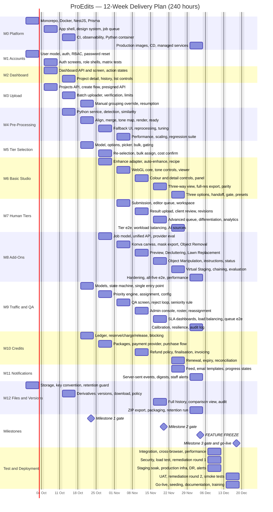

# ProEdits — 12-Week Delivery Plan

**AI and Human Assisted Photo Editing Platform · Full Build to Production**

| | |
|---|---|
| **Document** | ProEdits Delivery Plan v1.0 |
| **Date issued** | 21 September 2026 |
| **Basis** | ProEdits SRS v1.3 (September 2026); "AI = human process work flow" (client source flow document); confirmed technology stack; Figma design files — Client_User, Desk_user, QA—Editor_user |
| **Duration** | 12 weeks · one calendar quarter |
| **Modules** | 13 delivery tracks covering all 12 SRS modules plus platform infrastructure |
| **Total effort** | **240 engineering hours** |
| **Build window** | Weeks 1–10 — feature complete, 200 hours |
| **Test & deployment window** | Weeks 11–12 — 40 hours |
| **Milestones** | 3 |
| **Start** | Monday 28 September 2026 |
| **Go-live** | Friday 18 December 2026 |

---

## Table of Contents

1. [Scope Basis and Assumptions](#1-scope-basis-and-assumptions)
2. [Delivery Model](#2-delivery-model)
3. [Technology Stack](#3-technology-stack)
4. [Milestone Summary](#4-milestone-summary)
5. [Phase Breakdown by Module](#5-phase-breakdown-by-module)
6. [Gantt Chart](#6-gantt-chart)
7. [Timeline and Calendar](#7-timeline-and-calendar)
8. [Week-by-Week Plan — Milestone 1 (Weeks 1–4)](#8-week-by-week-plan--milestone-1-weeks-14)
9. [Week-by-Week Plan — Milestone 2 (Weeks 5–8)](#9-week-by-week-plan--milestone-2-weeks-58)
10. [Week-by-Week Plan — Milestone 3 (Weeks 9–12)](#10-week-by-week-plan--milestone-3-weeks-912)
11. [Effort Distribution](#11-effort-distribution)
12. [Dependency Order and Critical Path](#12-dependency-order-and-critical-path)
13. [Acceptance Criteria and Requirement Traceability](#13-acceptance-criteria-and-requirement-traceability)
14. [Open Issues and Decision Deadlines](#14-open-issues-and-decision-deadlines)
15. [Risk Register](#15-risk-register)
16. [Explicitly Excluded](#16-explicitly-excluded)
17. [Appendix A — Week × Module Hours Matrix](#appendix-a--week--module-hours-matrix)
18. [Appendix B — Deliverables Checklist](#appendix-b--deliverables-checklist)

---

## 1. Scope Basis and Assumptions

### 1.1 Scope statement

This plan delivers the **complete ProEdits platform as specified in SRS v1.3**, through to production deployment. Every one of the twelve SRS modules is built in full. There is no deferred phase, no reduced tier set and no partial add-on delivery.

At go-live on 18 December 2026 the platform supports the following, end to end:

1. **Registration, login and four account types** — client, editor, QA reviewer and administrator — each with its own authenticated entry point, with permissions enforced on every protected request by the backend rather than by hiding controls in the interface (FR-ACC.1–5).
2. **Password reset and account recovery** through a time-limited email token (FR-ACC.4).
3. **Client dashboard** showing current credit balance, monthly package status, active projects and completed projects, with each project card carrying name, creation date, image count, current status and associated tiers (FR-DASH.1–2).
4. **Distinct presentation of projects awaiting client action versus projects awaiting internal action**, so the two produce different calls to action (FR-DASH.3).
5. **Project creation as an explicit step**, followed by **batch upload** of single images and bracketed exposure sets directly to object storage, with multipart transfer and per-part retry (FR-UP.1–4).
6. **Permanent retention of every original exposure file**, separate from any derived image, for the lifetime of the project (FR-UP.5, FR-AI.6).
7. **Automatic exposure-bracket detection and grouping** from capture metadata and visual similarity, with a client-facing correction path when the automatic grouping is uncertain or fails (FR-AI.1–2, FR-AI.7).
8. **Exposure stacking and HDR rendering** into one working image per scene, which becomes the base for every subsequent step (FR-AI.3–5).
9. **Reprocessing of a scene without re-upload**, using the retained originals.
10. **Service tier selection per working image across all four tiers** — Basic, Basic Plus, Standard and Advanced — individually or applied in bulk (FR-TIER.1, FR-TIER.3).
11. **Basic tier self-service studio**: automatic AI Auto Enhance on selection, a manual editing panel carrying all fourteen adjustment controls, a three-way comparison between the original working image, the AI result and the client's own edit at matched zoom and position, and full-resolution export (FR-BASIC.1–3).
12. **Three client outcomes on Basic** — accept the AI result, save and download a manual edit, or send the image to a human editor after confirming the additional credit — plus a default satisfaction gate where no explicit choice is made (FR-BASIC.4–6).
13. **Human editing across Basic Plus, Standard and Advanced**, each following the same seven-step sequence, with Advanced placed in a high-priority queue and restricted to editors flagged as experienced (FR-HUMAN.1–4).
14. **All five AI add-ons** — Object Removal, Decluttering, Lawn Replacement, Object Manipulation and Virtual Staging — behind one consistent internal API, with brush and selection tools producing masks aligned to the original image dimensions (FR-ADDON.1–6).
15. **A single shared human queue.** Every task needing human attention — a rejected Basic AI result, a client's request to send Basic to a human, a Basic Plus / Standard / Advanced submission, or a rejected add-on result — enters the same queue through the same entry point (FR-TRAFFIC.1, FR-ADDON.7, FR-BASIC.7).
16. **Weighted priority calculation** across the five named inputs — monthly package, service quality, delivery time, queue position and editor availability — implemented as configurable weights rather than hardcoded logic (FR-TRAFFIC.2, NFR-MAIN.2).
17. **Editor assignment, QA review and a revision loop** in which every revision produces a new version and passes through QA again before reaching the client (FR-TRAFFIC.3–5, FR-HUMAN.5).
18. **Credits and monthly packages**: a transactional ledger recording purchases, package allocations, reservations, charges and refunds, with payment confirmed by verified provider webhooks (FR-CREDIT.1–5).
19. **Notifications** — in-app status feed and transactional email — telling clients when a result is ready and telling editors and QA reviewers when a task is assigned (SRS §3.11).
20. **Full version history and delivery**: originals, working images, AI results, manual results and every delivered revision retained and comparable, with final downloads and per-project ZIP export served through time-limited private links (FR-FILE.1–3).

### 1.2 The two non-negotiable rules

The SRS states only two requirements as firm rules rather than recommendations. Both constrain the architecture from the first week and are verified at every milestone gate.

| Rule | Requirement | How it is enforced |
|---|---|---|
| **Original files are never deleted** | FR-AI.6, FR-UP.5, Business Rule 6 — *"if an editor needs to manually fix windows, lighting, or other HDR problems, they may need access to the original exposures"* | No delete route exists for an original. Deletion is blocked at the data-access layer. Object-storage lifecycle rules exclude the originals prefix. An automated test asserts that project deletion, revision and add-on processing all leave originals intact. Built in Week 1, re-verified in Week 11. |
| **One shared human queue** | FR-TRAFFIC.1, Business Rule 4 — *"Every AI failure or human request must enter your existing Traffic Management System"* | Exactly one service method creates an editing task. An architecture test fails the build if a task is created anywhere else in the codebase. The method is idempotent, so a path can never produce a duplicate task and never silently drop one. Built in Week 4, before any consumer of it exists. |

Building the shared queue once and correctly, from the start, is the single most important sequencing decision in this plan. Retrofitting a second tier or a second add-on onto a queue that assumed one source of tasks is expensive; the queue is therefore built in Week 4 with the full task-source enumeration in place, and each tier and add-on plugs into it as it is completed.

### 1.3 Assumptions

| # | Assumption | Consequence if it does not hold |
|---|---|---|
| A1 | Open decisions listed in Section 14 are answered by the deadlines stated there. | Any week blocked on an unanswered decision slips one for one; the working default shipped in the meantime requires rework. |
| A2 | Hosted AI API accounts and keys for enhancement and generative editing are provisioned and funded by the client before Week 5. | Weeks 5–10 add-on and enhancement work cannot begin. |
| A3 | A representative sample set of real photographs — minimum 20 scenes, including mixed flash exposures, subject movement, blown windows, empty rooms for staging, and outdoor lawn shots — is supplied by the end of Week 2. | Exposure merge quality and add-on output quality cannot be tuned or validated against real conditions. |
| A4 | Editors and QA reviewers are internal or contracted staff, not a public marketplace, and work in their own desktop editing tools (SRS §2.6). | A public editor marketplace or an in-browser professional retouching suite is a separate programme. |
| A5 | The three Figma files are the single visual source and are final for the screens enumerated in SRS §4.1. | Redesign after a screen is built is handled as a change request against the next gate. |
| A6 | A payment provider supported in the operating jurisdiction is selected and account-approved before Week 5. | Credit purchase and package subscription cannot be completed in Week 5. |
| A7 | One staging environment and one production environment, with managed PostgreSQL and managed Redis. | Self-hosting database and cache infrastructure adds work not budgeted here. |
| A8 | Expected volume, concurrency and peak-load figures (SRS §10.11) are supplied before Week 11 load testing. | Infrastructure sizing and the performance targets cannot be confirmed against real conditions. |

---

## 2. Delivery Model

### 2.1 How effort is expressed in this plan

Work is organised into **module tracks**. Each track corresponds to one functional area of the platform and runs across a defined set of weeks.

> **The programme runs at 20 hours of effort per week, for 12 weeks — 240 hours in total.**

Those 20 hours are divided each week between the module tracks active in it: a week running four tracks gives each roughly five hours, a week running six divides the same 20 hours more finely. The weekly commitment never varies — what changes is how many fronts it is spread across. From Week 11 the whole 20 hours shifts to testing and deployment.

| Parameter | Value |
|---|---|
| Duration | 12 weeks |
| Module tracks | 13 (M0–M12), plus Test and Deployment tracks in Weeks 11–12 |
| Effort per week | 20 hours, divided across that week's active tracks |
| Build effort, Weeks 1–10 | 200 hours |
| Test and deployment effort, Weeks 11–12 | 40 hours |
| **Total programme effort** | **240 hours** |
| Milestones | 3, at the end of Weeks 4, 8 and 12 |
| Feature freeze | End of Week 10 |

### 2.2 Feature freeze and the two-week stabilisation window

**All feature development finishes at the end of Week 10.** Weeks 11 and 12 contain no new functionality. They are reserved entirely for:

- system integration testing across every module,
- cross-browser verification,
- performance measurement against the stated targets,
- a full security pass,
- load testing,
- two rounds of defect remediation,
- staging soak, production infrastructure build and go-live,
- documentation, operational training and handover.

This is a deliberate structure. A platform of this size cannot be tested meaningfully while it is still changing, and a deployment scheduled for the same week as the last feature is a deployment that slips. Reserving one sixth of the programme for stabilisation is what makes the 18 December go-live a date rather than an aspiration.

### 2.3 Weekly working agreement

| Slot | Hours | Content |
|---|---:|---|
| Implementation | 16 | Build against that week's task list |
| Verification | 3 | Unit and integration tests written in the same week as the code they cover, never deferred |
| Coordination | 1 | Written status, cross-track integration points, open-issue chase |
| **Per week** | **20** | |

### 2.4 Definition of Done

A task is complete when all of the following hold. This applies to every task in Sections 8 to 10 without exception.

1. TypeScript compiles under `strict`; no untyped escape hatch without an inline justification.
2. Authorisation is enforced in the backend. Hiding a control in the interface is a presentation decision and never the access control.
3. Unit tests cover the success path and every documented failure path. Any state transition or credit movement additionally carries an integration test.
4. Errors are caught and either handled or re-thrown with context. No silent failure, and no indefinite loading state presented to a user.
5. The database migration is committed and applies cleanly to an empty database.
6. The requirement identifiers listed against that week in Section 13 are demonstrable.
7. Merged through review with the continuous integration pipeline green.

### 2.5 Milestone gate procedure

At the end of Weeks 4, 8 and 12:

1. Live demonstration against that milestone's exit-criteria checklist, referenced to SRS requirement identifiers.
2. Defect triage — blocking defects are fixed inside the gate; non-blocking defects are logged against a named week.
3. The open-issue register in Section 14 is updated, and any decision still outstanding is recorded as a schedule risk against the week it affects.
4. Written sign-off before the following milestone begins.

---

## 3. Technology Stack

Exactly as confirmed. No substitutions.

| Part | Technology |
|---|---|
| Frontend | **React + TypeScript** (strict mode) |
| Backend | **Node.js + TypeScript**, framework **NestJS** |
| Database access | **Prisma** |
| Database | **PostgreSQL** (managed) |
| Image storage | **Amazon S3** |
| Browser editing | Brush and selection tools and adjustment previews — **React Konva** for mask painting, **WebGL** for live slider previews |
| Background processing | A Node-compatible job queue with separate workers — **BullMQ on Redis** (managed) |
| Generative editing | **Hosted AI APIs**, behind one internal ProEdits adapter interface |
| Exposure merging and advanced processing | **Python / OpenCV** workers |
| Server-side raster operations | **Sharp** — thumbnails, derivatives, routine full-resolution operations |
| Deployment | **Docker** — the React application, the Node API and the processing workers run as separate services |
| Email | Transactional email service |
| Payments | A payment provider supported in the operating jurisdiction, confirmed by verified webhooks |

### 3.1 Service topology

Three processing engines feed one shared operational pipeline, matching the architecture the source flow document recommends and SRS §5.1 formalises.

```
┌─────────────────────┐          ┌──────────────────────────┐        ┌────────────────────┐
│  React + TypeScript │  HTTPS   │  NestJS API              │ Prisma │  PostgreSQL        │
│  client · editor    │─────────▶│  auth · RBAC · projects  │───────▶│  managed           │
│  QA · admin         │          │  tiers · queue · credits │        └────────────────────┘
└──────────┬──────────┘          │  versions · notifications│
           │                     └────────────┬─────────────┘
           │ presigned                        │ BullMQ
           │ multipart                        ▼
           ▼                     ┌──────────────────────────┐        ┌────────────────────┐
┌─────────────────────┐          │  Node Workers            │───────▶│  Redis (managed)   │
│  Amazon S3          │◀────────▶│  enhance · add-on ·      │        └────────────────────┘
│  originals          │          │  export · zip · thumbs   │
│  working            │          └────────────┬─────────────┘
│  ai                 │                       │ internal HTTP
│  manual             │                       ▼
│  delivered          │          ┌──────────────────────────┐
│  masks              │◀────────▶│  Python / OpenCV service │   ENGINE 1
│  thumbs             │          │  detect · group · align  │   AI Pre-Processing
└─────────────────────┘          │  merge · tone map ·render│
                                 └──────────────────────────┘
                                 ┌──────────────────────────┐
                                 │  Hosted AI APIs          │   ENGINE 2
                                 │  auto enhance · removal  │   AI Add-On
                                 │  declutter · lawn ·      │
                                 │  manipulate · stage      │
                                 └──────────────────────────┘
                                 ┌──────────────────────────┐
                                 │  Workflow state in       │   ENGINE 3
                                 │  PostgreSQL + staff UI   │   Human Editing
                                 └──────────────────────────┘
                                              │
              ALL THREE ENGINES FEED ONE CHAIN ▼
        Traffic Management → Editor Assignment → QA → Revision → Delivery
```

The three engines are separated in the codebase and in the deployment, not only conceptually, so that changing an AI model or vendor in one engine requires no change to the others (NFR-MAIN.1), and so that the processing capacity can grow independently of the web tier (NFR-SCALE.1).

### 3.2 Storage key convention

Fixed in Week 1 and used unchanged for the remainder of the programme. Every saved result receives its own key; PostgreSQL records which original or earlier version it derives from.

| File class | Key pattern | Written by |
|---|---|---|
| Originals | `projects/{projectId}/originals/{originalFileId}.{ext}` | Browser, via presigned multipart upload |
| Working image | `projects/{projectId}/working/{workingImageId}.jpg` | Python / OpenCV service |
| AI result — auto enhance | `projects/{projectId}/ai/{workingImageId}/enhance-{jobId}.jpg` | Node worker |
| AI result — add-on | `projects/{projectId}/ai/{workingImageId}/addon-{addOnJobId}.jpg` | Node worker |
| Manual result | `projects/{projectId}/manual/{workingImageId}/v{n}.jpg` | Export worker (Sharp) |
| Delivered versions | `projects/{projectId}/delivered/{workingImageId}/v{n}.jpg` | Editor upload / export worker |
| Masks | `projects/{projectId}/masks/{addOnJobId}.png` | Browser, exported from React Konva |
| Thumbnails and previews | `projects/{projectId}/thumbs/{entityId}.webp` | Node worker (Sharp) |

The bucket is private with no public access. Every read is served through a time-limited presigned URL issued only after the API has authorised the request. Encryption is enabled at rest and enforced in transit (NFR-SEC.3).

---

## 4. Milestone Summary

| Milestone | Weeks | Dates | Hours | Theme | Gate |
|---|---|---|---:|---|---|
| **Milestone 1 — Foundation and Ingestion** | 1–4 | 28 Sep – 25 Oct 2026 | 80 | Platform, four-role authentication, dashboard, batch upload with permanent original retention, the AI Pre-Processing Engine, four-tier selection, and the shared queue and credit ledger foundations | Fri 23 Oct 2026 |
| **Milestone 2 — Editing Engines and Human Pipeline** | 5–8 | 26 Oct – 22 Nov 2026 | 80 | The full fourteen-control Basic studio, all human tiers with weighted priority routing, QA and revisions, the add-on engine with the first three add-ons, and packages with payments | Fri 20 Nov 2026 |
| **Milestone 3 — Completion, Testing and Deployment** | 9–12 | 23 Nov – 20 Dec 2026 | 80 | The remaining add-ons including Virtual Staging, notifications, delivery and version history, **feature freeze at the end of Week 10**, then system testing, UAT, hardening and production go-live | Fri 18 Dec 2026 |

### 4.1 Milestone 1 — Foundation and Ingestion · Weeks 1–4 · 80 hours

**Goal.** A client creates a project, uploads a bracketed exposure set, receives a rendered working image with every original retained, and selects a service tier from all four — against a live credit balance and a queue that is already built to receive every future task source.

**Exit criteria**

- [ ] Four account types register, log in, refresh and log out; password reset works end to end; a request for another account's resource returns a refusal from the backend guard, not from a hidden control (FR-ACC.1–5, NFR-SEC.1).
- [ ] The dashboard shows credit balance, package status, active projects and completed projects, and distinguishes projects awaiting client action from those awaiting internal action (FR-DASH.1–3).
- [ ] No client-facing response anywhere exposes an editor identity, a QA identity or an internal queue position (FR-DASH.4).
- [ ] A 50-file batch containing multiple brackets uploads directly to object storage with per-part retry and resumption after interruption (FR-UP.2–4).
- [ ] Brackets are detected and grouped from capture metadata and visual similarity, with a confidence score recorded per group (FR-AI.1–2).
- [ ] Exposures are aligned, merged and tone-mapped into one working image per scene, written to storage and marked ready, within 60 seconds per group (FR-AI.3–5, NFR-PERF.1).
- [ ] Deleting a project, running a revision or processing an add-on leaves every original file intact (FR-AI.6, Business Rule 6).
- [ ] A tier can be selected per working image across all four tiers, individually or in bulk, and cannot be selected until pre-processing has succeeded or the client has confirmed a grouping (FR-TIER.1, FR-TIER.3, Business Rule 1).
- [ ] The credit ledger reserves, charges and releases inside serialisable transactions; two concurrent submissions cannot spend the same credit.
- [ ] Exactly one service method creates an editing task, enforced by an automated architecture test that fails the build on a second creation site (FR-TRAFFIC.1, Business Rule 4).
- [ ] The full stack starts from a single command locally; migrations apply cleanly from an empty database.

### 4.2 Milestone 2 — Editing Engines and Human Pipeline · Weeks 5–8 · 80 hours

**Goal.** Both editing engines are operational and the human pipeline carries real work. A Basic image travels the complete Option C flow; a Basic Plus, Standard or Advanced image travels the complete seven-step human flow including a revision; three of the five add-ons produce results and route rejections into the same queue.

**Exit criteria**

- [ ] Selecting Basic automatically runs AI Auto Enhance and presents the result as a preview with no button press required (FR-BASIC.1).
- [ ] All fourteen adjustment controls operate live in the browser with visible before-and-after feedback and require no documentation to use (FR-BASIC.2, NFR-USE.1).
- [ ] The three-way toggle switches between the original working image, the AI result and the client's manual edit at an identical zoom level and pan position (FR-BASIC.3).
- [ ] Full-resolution export reproduces the browser preview within the agreed numeric tolerance across the reference image set.
- [ ] Basic Plus, Standard and Advanced each complete the seven-step sequence; Advanced is placed in a high-priority queue and cannot be assigned to an editor not flagged as experienced, including through a manual administrator action, unless that override is explicit and logged (FR-HUMAN.1–4, Business Rule 3).
- [ ] Priority is calculated from all five named inputs as configurable weights, adjustable without a code change (FR-TRAFFIC.2, NFR-MAIN.2).
- [ ] QA approves or returns with comments; a return routes back to the same editor and escalates to a lead after a configurable number of cycles (FR-TRAFFIC.4).
- [ ] A client revision request creates a new version and always passes through QA again before reaching the client (FR-HUMAN.5, Business Rule 7).
- [ ] Every delivered revision is retained as its own version and is comparable against earlier versions (FR-FILE.2).
- [ ] Object Removal, Decluttering and Lawn Replacement each accept a brush-painted mask exported at the original image's pixel dimensions, return a result, and on rejection enter the same shared queue as every human request (FR-ADDON.1–4, FR-ADDON.7).
- [ ] Credits reserve on submission, charge on client approval and release on cancellation before editing starts; monthly packages allocate and renew; payment is confirmed only by a verified provider webhook (FR-CREDIT.1–4, Business Rule 5).

### 4.3 Milestone 3 — Completion, Testing and Deployment · Weeks 9–12 · 80 hours

**Goal.** The platform is feature complete at the end of Week 10, then tested, hardened, documented, deployed and handed over.

**Exit criteria**

- [ ] Object Manipulation accepts a marked region plus a short instruction and produces a result; Virtual Staging accepts an empty-room image, a room type and a style, and generates furnished output (FR-ADDON.5–6).
- [ ] Multiple add-ons can be applied to one image before delivery.
- [ ] The three Basic client options and the satisfaction gate all resolve correctly, and a Basic image sent to a human enters the same pipeline as every other human request (FR-BASIC.4–7).
- [ ] Clients and staff receive in-app notification and transactional email on result-ready, task-assigned and revision-completed events, with live status delivered by server-sent events (SRS §3.11).
- [ ] Final files and per-project ZIP archives download through time-limited private links after backend authorisation (SRS §4.1).
- [ ] The retention policy is implemented and executes, with the originals prefix excluded from every lifecycle rule (FR-FILE.3, §10.6).
- [ ] **Feature freeze holds from the end of Week 10.** No functional change enters Weeks 11 or 12 outside defect remediation.
- [ ] Performance meets NFR-PERF.1, NFR-PERF.2 and NFR-PERF.3 on the reference set, measured and recorded.
- [ ] The full role-permission matrix passes; storage is encrypted at rest and in transit; the bucket is private; presigned links expire; no secret is committed (NFR-SEC.1–3).
- [ ] Load testing passes against the confirmed volume assumptions.
- [ ] The application renders and functions on current Chrome, Safari, Edge and Firefox, on desktop and mobile web (NFR-PORT.1).
- [ ] Backup and restore are verified; monitoring and alerting are live (NFR-AVAIL.2).
- [ ] UAT is executed with real client, editor, QA and administrator accounts and signed off.
- [ ] Production deployment completes; smoke tests pass; runbook, environment reference, API documentation and operational training materials are handed over.

---

## 5. Phase Breakdown by Module

All thirteen delivery tracks, mapped across the three milestones. Every SRS module appears; nothing is deferred beyond the programme.

| # | Module | Milestone 1 · Weeks 1–4 | Milestone 2 · Weeks 5–8 | Milestone 3 · Weeks 9–12 | Weeks active | Hours |
|---|---|---|---|---|---|---:|
| **M0** | **Platform & Infrastructure** | Monorepo with strict TypeScript, linting and commit conventions; local Docker Compose across database, cache and object storage; NestJS skeleton with validated configuration, global validation, error mapping and health checks; Prisma migration workflow; React application shell with token refresh; design system from Figma; job queue with separate worker processes, retry, backoff and dead-letter handling; continuous integration; structured logging, correlation identifiers and metrics; containerised Python service with internal service authentication | — | Production container images for the web application, API, workers and Python service; continuous deployment to staging with migration on deploy and a documented rollback path; managed PostgreSQL and managed Redis provisioning | 1, 2, 3, 10 | **19.75** |
| **M1** | **Accounts & Authentication** | User model with four roles and a seniority flag; register, login, refresh and logout; strong password hashing; short-lived access token with rotating refresh; role guards and an ownership guard; password reset and account recovery with a time-limited token; login, registration and reset screens; role-routed application shells for all four account types; full role-permission matrix tests | — | — | 1, 2 | **11.75** |
| **M2** | **Client Dashboard** | Dashboard API returning credit balance, monthly package status, active and completed project lists with counts; dashboard screen with project cards carrying name, date, image count, status and tier; distinction between projects awaiting client action and those awaiting internal action; suppression of editor and QA identity in every client-facing response; project detail screen with image grid, per-image status and group view; per-project activity history; filtering, sorting, pagination and complete empty, loading and error states | — | — | 2, 3 | **9** |
| **M3** | **Project Creation & Upload** | Project model with create, list and detail endpoints under ownership guards; create-project flow; presigned multipart upload with initiate, part signing, completion and abort, authorised against project access before any temporary permission is issued; drag-and-drop batch uploader with multi-select, per-file and per-part progress, automatic retry with backoff, and cancel; upload verification with capture-metadata extraction; configurable format, size, resolution and count limits validated on both request and completion; client-side manual bracket grouping override; upload resumption across sessions and cleanup of orphaned transfers | — | — | 2, 3, 4 | **13** |
| **M4** | **AI Pre-Processing Engine** | Python and OpenCV service with a documented internal contract; bracket detection from capture time and exposure-value delta; scene grouping confirmed by feature and histogram similarity with a recorded confidence score; exposure alignment with ghost handling; HDR merge and exposure fusion with tone mapping and configurable parameters; working-image render to storage with a ready state; per-group progress endpoint | Client-facing fallback presenting originals ungrouped for manual bracket confirmation when detection is uncertain or fails; reprocessing a scene from retained originals without re-upload; tuning against the client sample set for mixed flash, subject movement and window detail; performance tuning to the 60-second target; independent scaling of the engine with tuned queue concurrency; graceful degradation to a visible delayed state; a regression suite across the sample set | — | 3, 4, 5, 6 | **15.5** |
| **M5** | **Service Tier Selection** | Tier model covering all four tiers; tier options and pricing endpoint per working image; tier picker on the post-processing working-image grid, per image and applied in bulk across a selection; gating that prevents tier selection until pre-processing has succeeded or a grouping has been confirmed | Tier change and re-selection rules before submission; project-level bulk assignment; tier-to-credit cost resolution with an explicit confirmation step; end-to-end coverage across all four tiers | — | 4, 5 | **7** |
| **M6** | **Basic Tier — AI and Self Editing** | — | Enhancement provider adapter with a two-candidate benchmark against the sample set; auto-triggered AI Auto Enhance writing to its own storage key; edit-session model with a validated adjustment-recipe schema; WebGL preview engine with texture pipeline and recipe binding; tone controls — brightness, exposure, contrast, highlights, shadows, whites, blacks; colour controls — temperature, tint, hue, saturation, vibrance; detail controls — sharpening, clarity; shared zoom and pan viewer; grouped slider panel with per-control reset, numeric readout and an unsaved-changes guard; three-way view toggle at matched position; full-resolution export worker; preview-to-export parity test with a numeric tolerance | Three client options — accept the AI result, save and download a manual edit, or send to a human editor; credit confirmation before handoff with routing through the shared pipeline; satisfaction gate default path; presets and saved edit styles | 5, 6, 7, 8, 9 | **19.5** |
| **M7** | **Human Edited Tiers** | — | Tier submission for Basic Plus, Standard and Advanced reserving credit and creating exactly one task through the shared entry point; priority-sorted editor queue; editor task workspace exposing client instructions, the working image and the original exposures through time-limited download links; result upload creating a new delivered version and submission for QA; client review screen with approve or request-revision; revision loop returning through an editor and then QA; Advanced high-priority queue behaviour with delivery deadlines; tier differentiation in interface and pricing; editor performance analytics covering throughput, QA pass rate and cycle time | End-to-end coverage across Basic Plus, Standard and Advanced including revisions; editor workload balancing with deadline surfacing; handling of rejected-AI sources in the workspace, presenting the original, the AI attempt and any mask together | 6, 7, 8, 9 | **16** |
| **M8** | **AI Add-On Engine** | — | Add-on job model carrying the full five-type enumeration; one unified internal add-on API for creation, status, result and client decision; provider adapter interface with evaluation across all five effects; React Konva canvas with brush, size, hardness, eraser, undo, redo and clear; mask export at the original image's pixel dimensions; Object Removal provider integration with worker and result storage; result preview with accept and reject, rejection entering the shared queue; Decluttering with multi-item marking and scene reconstruction; Lawn Replacement with region marking and appearance selection; Object Manipulation with a marked region plus a short instruction from a constrained action set; instruction validation and per-provider request construction; job status, progress and failure surfacing | Virtual Staging with empty-room selection, room type, style and generation; add-on chaining across one image before delivery; a result-evaluation harness for structural fidelity; engine hardening with retries, provider failover and cost tracking; end-to-end coverage of all five add-ons including reject-to-queue for each; performance tuning to the 30-second target | 5, 6, 7, 8, 9, 10 | **23.5** |
| **M9** | **Traffic Management, Assignment & QA** | Task, QA review and revision request models; a guarded state machine with table-driven coverage of every legal and illegal transition; the single entry point for task creation, idempotent per source, enforced by an architecture test | Priority engine with five configurable weighted inputs; editor assignment accounting for availability and seniority; priority rule configuration with an administrator API; QA review screen with synchronised source-and-result comparison; approve and return-with-comments, with a cycle cap and lead escalation; restriction of Advanced work to senior editors with a logged force-override; administrator console for queue monitoring with age and deadline indicators; editor roster, seniority flags and availability management; manual reassignment and priority override with an audit trail; service-level dashboards with per-tier turnaround and breach alerting; load balancing across editor pools; end-to-end queue coverage across all four tiers and both rejected-AI paths | Priority formula calibration against the agreed weights; queue resilience with stuck-task detection, reassignment and dead-letter review; administrator audit log and configuration change history | 4, 5, 6, 7, 8, 10 | **23.5** |
| **M10** | **Credits & Package Accounting** | Credit ledger model with a derived balance; reserve, charge and release inside serialisable transactions with idempotency keys; a concurrency suite proving two requests cannot spend the same credit; balance display and insufficient-credit blocking | Package model with allocation, renewal and a defined consumption order against included credits; payment provider integration with verified webhook handling and idempotent settlement; purchase flow for credit bundles and package subscription; refund and release rules as a configurable policy; charge finalisation on approval and release on pre-edit cancellation; invoicing with statements, ledger export and receipts | Package renewal, proration, upgrade and downgrade; credit expiry, low-balance alerts and automatic top-up; financial reconciliation reporting and ledger integrity checks | 4, 5, 7, 9 | **15** |
| **M11** | **Notifications** | — | — | Notification model with an in-app feed and read state; transactional email service with a template for every event; client progress states surfaced across the dashboard and project detail; server-sent events replacing polling for live status; digest emails and notification preferences; editor and QA assignment notifications and escalation alerts | 9, 10 | **8** |
| **M12** | **File & Version Management** | Object-storage configuration with a private policy, encryption and cross-origin rules for direct browser upload; storage service implementing the eight-class key convention; file-lineage schema linking originals, working images and delivered versions; retention guard preventing deletion of originals, with lifecycle exclusion and an automated test; thumbnail and preview derivative pipeline; delivered-version model with an incrementing version number and a lineage endpoint; presigned time-limited download service under backend authorisation; configurable retention policy per file class | Full version history across every revision; client-facing version comparison view; version-level access control and audit trail | Per-project ZIP export worker with completion notification; delivery packaging with naming conventions, format options and embedded metadata; retention policy execution with lifecycle rules that exclude the originals prefix | 1, 3, 8, 10 | **18.5** |
| — | **System Test & UAT** | — | — | System integration testing across every module; cross-browser verification on desktop and mobile web; performance verification against all three targets; full security pass covering the role matrix, encryption, bucket policy, link expiry, secrets and dependencies; load testing; two rounds of defect remediation; UAT execution with real accounts in every role; post-deployment smoke tests | 11, 12 | **20** |
| — | **Deployment & Handover** | — | — | Staging environment build and soak; production infrastructure with the web tier scaling independently of the processing engines; backup, restore and disaster-recovery verification; monitoring, alerting and an on-call runbook; production deployment and go-live; data seeding, editor roster onboarding and package configuration; deployment runbook, environment reference and API documentation; operational training materials for administrator, editor and QA roles; gate, handover and closure of the open-issue register | 11, 12 | **20** |
| | **TOTAL** | **80 h** | **80 h** | **80 h** | | **240** |

---

## 6. Gantt Chart

### 6.1 Week grid

Each `███` is one module track active that week; the 20 hours of that week are shared between the tracks marked in its column. `◆` marks a milestone gate; `▓▓▓` marks testing and deployment.

```
                                    ┌─── MILESTONE 1 ───┬─── MILESTONE 2 ───┬─── MILESTONE 3 ───┐
TRACK                                W1  W2  W3  W4 │ W5  W6  W7  W8 │ W9 W10 │W11 W12         h
                                    ─── ─── ─── ───┼─── ─── ─── ───┼─── ───┼─── ───        ───
M0  Platform & Infrastructure       ███ ███ ███  ·  │ ·   ·   ·   ·  │ ·  ███ │ ·   ·       19.75
M1  Accounts & Authentication       ███ ███  ·   ·  │ ·   ·   ·   ·  │ ·   ·  │ ·   ·       11.75
M2  Client Dashboard                 ·  ███ ███  ·  │ ·   ·   ·   ·  │ ·   ·  │ ·   ·           9
M3  Project Creation & Upload        ·  ███ ███ ███ │ ·   ·   ·   ·  │ ·   ·  │ ·   ·          13
M4  AI Pre-Processing Engine          ·   ·  ███ ███ │███ ███  ·   ·  │ ·   ·  │ ·   ·        15.5
M5  Service Tier Selection            ·   ·   ·  ███ │███  ·   ·   ·  │ ·   ·  │ ·   ·           7
M6  Basic Tier — AI & Self Editing    ·   ·   ·   ·  │███ ███ ███ ███ │███  ·  │ ·   ·        19.5
M7  Human Edited Tiers                ·   ·   ·   ·  │ ·  ███ ███ ███ │███  ·  │ ·   ·          16
M8  AI Add-On Engine                  ·   ·   ·   ·  │███ ███ ███ ███ │███ ███ │ ·   ·        23.5
M9  Traffic Mgmt, Assignment & QA     ·   ·   ·  ███ │███ ███ ███ ███ │ ·  ███ │ ·   ·        23.5
M10 Credits & Package Accounting      ·   ·   ·  ███ │███  ·  ███  ·  │███  ·  │ ·   ·          15
M11 Notifications                     ·   ·   ·   ·  │ ·   ·   ·   ·  │███ ███ │ ·   ·           8
M12 File & Version Management        ███  ·  ███  ·  │ ·   ·   ·  ███ │ ·  ███ │ ·   ·        18.5
    System Test & UAT                 ·   ·   ·   ·  │ ·   ·   ·   ·  │ ·   ·  │▓▓▓ ▓▓▓         20
    Deployment & Handover             ·   ·   ·   ·  │ ·   ·   ·   ·  │ ·   ·  │▓▓▓ ▓▓▓         20
                                    ─── ─── ─── ───┼─── ─── ─── ───┼─── ───┼─── ───        ───
    MILESTONE GATE                    ·   ·   ·   ◆  │ ·   ·   ·   ◆  │ ·   ·  │ ·   ◆
    FEATURE FREEZE                    ·   ·   ·   ·  │ ·   ·   ·   ·  │ ·  ▲   │ ·   ·
    ACTIVE TRACKS                      3   4   5   5 │  6   5   5   5 │  5   5 │  2   2
    HOURS THIS WEEK                   20  20  20  20 │ 20  20  20  20 │ 20  20 │ 20  20       240
    CUMULATIVE                        20  40  60  80 │100 120 140 160 │180 200 │220 240
```

### 6.2 Mermaid Gantt



### 6.3 Dependency overlay

```
  W1 ─────────────────────────────────────────────────────────────────────────────────▶
  M0 Platform ──┬──▶ M1 Accounts ──┬──▶ M2 Dashboard
                │                  │
                │                  └──▶ M3 Upload ──▶ M4 Pre-Processing ──▶ M5 Tiers
                │                            ▲                                   │
  M12 Storage ──┴────────────────────────────┘                                   │
       │                                                                          │
       │                                    ┌─────────────────────────────────────┤
       │                                    ▼                                     ▼
       │                            M10 Credits ─────────────▶ M9 Traffic Management
       │                                                          (SINGLE ENTRY POINT)
       │                                                                   │
       │                            ┌──────────────────────────────────────┼──────────────┐
       │                            ▼                                      ▼              ▼
       │                   M6 Basic Studio                        M7 Human Tiers   M8 Add-Ons
       │                   (send to human) ───────────┐                   │         (reject) │
       │                                              └───────────────────┼─────────────────┘
       │                                                                  ▼
       └───────────────────────────────────────────────▶ M12 Versions ──▶ M11 Notifications
                                                                          │
                                                                          ▼
                                                        W11–12 TEST ──▶ DEPLOY ──▶ GO-LIVE
```

Every path that needs a human — the Basic studio's send-to-human, a human-tier submission, and a rejected add-on result — converges on the single entry point built in Week 4. That convergence is the reason the queue is built before any of its three consumers.

---

## 7. Timeline and Calendar

| Week | Dates (Mon–Sun) | Milestone | Active module tracks | Hours | Cumulative | Key output |
|---|---|---|---|---:|---:|---|
| **W1** | 28 Sep – 4 Oct 2026 | 1 | M0, M1, M12 | 20 | 20 | Running platform, four-role authentication, storage with original retention enforced |
| **W2** | 5 – 11 Oct 2026 | 1 | M0, M1, M2, M3 | 20 | 40 | Client application shell, dashboard, project creation, presigned upload API |
| **W3** | 12 – 18 Oct 2026 | 1 | M0, M2, M3, M4, M12 | 20 | 60 | Batch upload working; bracket detection and grouping operational |
| **W4** | 19 – 25 Oct 2026 | 1 | M3, M4, M5, M9, M10 | 20 | 80 | **◆ Working image rendered; four-tier selection; shared queue and ledger live — Gate Fri 23 Oct** |
| **W5** | 26 Oct – 1 Nov 2026 | 2 | M4, M5, M6, M8, M9, M10 | 20 | 100 | AI Auto Enhance, add-on foundation, priority engine, packages and payments |
| **W6** | 2 – 8 Nov 2026 | 2 | M4, M6, M7, M8, M9 | 20 | 120 | WebGL preview, editor workspace, mask painting, QA review |
| **W7** | 9 – 15 Nov 2026 | 2 | M6, M7, M8, M9, M10 | 20 | 140 | Full control set, revision loop, three add-ons, administrator console |
| **W8** | 16 – 22 Nov 2026 | 2 | M6, M7, M8, M9, M12 | 20 | 160 | **◆ Both editing engines and the full human pipeline operational — Gate Fri 20 Nov** |
| **W9** | 23 – 29 Nov 2026 | 3 | M6, M7, M8, M10, M11 | 20 | 180 | Virtual Staging, add-on chaining, Basic options complete, notifications |
| **W10** | 30 Nov – 6 Dec 2026 | 3 | M0, M8, M9, M11, M12 | 20 | 200 | **▲ FEATURE FREEZE — production infrastructure, delivery packaging, live status** |
| **W11** | 7 – 13 Dec 2026 | 3 | System Test, Deployment | 20 | 220 | Integration, performance, security, load testing; staging soak; production build |
| **W12** | 14 – 20 Dec 2026 | 3 | System Test, Deployment | 20 | 240 | **◆ UAT signed, production go-live, handover — Gate Fri 18 Dec** |

### 7.1 Calendar

```
      SEPTEMBER / OCTOBER 2026              NOVEMBER 2026                    DECEMBER 2026
   Mo Tu We Th Fr Sa Su                  Mo Tu We Th Fr Sa Su             Mo Tu We Th Fr Sa Su
   28 29 30  1  2  3  4   W1                                  1  W5        1  2  3  4  5  6   W10
    5  6  7  8  9 10 11   W2              2  3  4  5  6  7  8  W6         7  8  9 10 11 12 13   W11
   12 13 14 15 16 17 18   W3              9 10 11 12 13 14 15  W7        14 15 16 17[18]19 20   W12
   19 20 21 22[23]24 25   W4             16 17 18 19[20]21 22  W8                    ▲
   26 27 28 29 30 31      W5             23 24 25 26 27 28 29  W9                    └─ MILESTONE 3
             ▲                           30                    W10                      GO-LIVE
             └─ MILESTONE 1 GATE                   ▲
                                                   └─ MILESTONE 2 GATE      ▲ Feature freeze: Sun 6 Dec
```

---

## 8. Week-by-Week Plan — Milestone 1 (Weeks 1–4)

Tasks are grouped by module track. Each track carries 20 hours in each week it appears, and every week's task hours sum to that week's total.

### Week 1 — Platform, authentication and storage foundation
**28 Sep – 4 Oct 2026 · 20 hours · Tracks: M0, M1, M12**

#### M0 — Platform & Infrastructure · 6.75 h

| ID | Task | Detail | h |
|---|---|---|---:|
| 1.0.1 | Monorepo and tooling | Workspace with four applications: the React client, the NestJS API, the Node worker and the Python processing service. Shared base TypeScript configuration with `strict` and `noUncheckedIndexedAccess`. Linting and formatting enforced on commit; Conventional Commits enforced by a commit-message hook. | 1.75 |
| 1.0.2 | Local infrastructure | Docker Compose bringing up PostgreSQL 16, Redis 7 and an S3-compatible object store for local development. A complete environment-variable example file with every key documented; no secret committed to the repository at any point. | 1.75 |
| 1.0.3 | NestJS API skeleton | Configuration module with schema-validated environment parsing that refuses to start on a missing or malformed value. Global validation pipe with whitelisting and transformation. Global exception filter mapping every error to one consistent response envelope. Health and readiness endpoints. Request logging with a correlation identifier propagated to workers. | 2 |
| 1.0.4 | Prisma migration workflow | Prisma initialised against PostgreSQL with the generated client wired into the API. Migration workflow documented and a seed harness created for local and staging data. | 1.25 |

#### M1 — Accounts & Authentication · 6.75 h

| ID | Task | Detail | h |
|---|---|---|---:|
| 1.1.1 | User model | `User` with identifier, role enumeration across client, editor, QA reviewer and administrator, email as a unique login, password hash, nullable seniority level used later for Advanced assignment, creation timestamp and last-login timestamp — per SRS §6.2. First migration applied. | 1 |
| 1.1.2 | Authentication endpoints | Register, login, refresh and logout. Argon2id password hashing. Short-lived access token paired with a rotating refresh token, with refresh-token reuse detection. Last-login timestamp written on each successful login. Invalid credentials return one uniform refusal that does not disclose whether an account exists. | 2.25 |
| 1.1.3 | Role-based access control | Authentication guard, role guard and a role decorator covering all four account types. An ownership-guard primitive for resource-level checks used by every later module. Access control is enforced here, in the backend, on every protected request. | 1.75 |
| 1.1.4 | Password reset and recovery | Reset request, time-limited single-use token, and password change, with the token invalidated on use and on password change. Email dispatch behind an interface so the transactional provider is swappable. Rate limiting on the request endpoint. | 1.75 |

#### M12 — File & Version Management · 6.5 h

| ID | Task | Detail | h |
|---|---|---|---:|
| 1.12.1 | Object storage configuration | Private bucket with public access blocked entirely, server-side encryption enabled, versioning configured, and cross-origin rules permitting direct browser upload from the application origin only. | 1.25 |
| 1.12.2 | Storage service and key convention | A single storage service implementing the eight-class key convention in Section 3.2. All presigning — for upload and for time-limited download — routes through this service, so no other module constructs a key or a URL directly. | 2 |
| 1.12.3 | File lineage schema | `OriginalFile`, `WorkingImage` and `DeliveredVersion` with the foreign keys that record which original or earlier version each derived file came from, per SRS §6.2. Every saved result receives its own storage key; the relationship between them lives in the database. | 2 |
| 1.12.4 | Original retention guard | Deletion of an original is blocked at the data-access layer, no delete route exists, and lifecycle rules exclude the originals prefix. An automated test asserts that cascading a project deletion does not remove an original file or object. This is Business Rule 6 and FR-AI.6, implemented in the first week rather than added as a later policy. | 1.25 |

**Deliverable.** The full stack starts from one command. Four account types register, log in, refresh and reset their password. Storage is private, encrypted and structured, and originals cannot be deleted.

**Acceptance.** FR-ACC.1, FR-ACC.2, FR-ACC.3, FR-ACC.4, FR-ACC.5, FR-AI.6 (data layer), FR-UP.5, FR-FILE.1 (schema), NFR-SEC.1, NFR-SEC.3, Business Rule 6.

**Depends on.** Nothing. **Blocks.** Every subsequent week — SRS §9.5 sequence item 1: everything else requires authenticated actors.

---

### Week 2 — Client application, dashboard and upload API
**5 – 11 Oct 2026 · 20 hours · Tracks: M0, M1, M2, M3**

#### M0 — Platform & Infrastructure · 5 h

| ID | Task | Detail | h |
|---|---|---|---:|
| 2.0.1 | React application shell | React with TypeScript in strict mode, routing, server-state management, and an HTTP client that attaches the access token and transparently refreshes and retries once on expiry. Functional components throughout; asynchronous code uses `async`/`await`. | 1.75 |
| 2.0.2 | Design system from Figma | Design tokens — colour, typography, spacing, elevation, radius — extracted from the Client_User, Desk_user and QA—Editor_user files, plus the shared component set they have in common: buttons, inputs, cards, status chips, modals, toasts, tables and empty states. Built once here so all four role interfaces stay consistent. | 1.75 |
| 2.0.3 | Job queue and worker process | BullMQ on Redis with the worker running as its own process, separate from the API. Queue registry covering pre-processing, enhancement, add-on, export and archive work. Retry with exponential backoff, attempt limits, dead-letter handling and job-level structured logging. | 1.5 |

#### M1 — Accounts & Authentication · 5 h

| ID | Task | Detail | h |
|---|---|---|---:|
| 2.1.1 | Login and registration screens | Client_User authentication screens with field-level validation, inline error surfacing, loading state and a clear failure state. No failure is swallowed. | 1.25 |
| 2.1.2 | Password reset screens and emails | Request, confirmation and new-password screens, with the matching transactional email templates and expiry messaging. | 1 |
| 2.1.3 | Role-routed application shells | Four shells with their own navigation and layout: client (Client_User), editor and administrator (Desk_user), QA reviewer (QA—Editor_user). Route guards read the role claim. This is navigation only; the backend remains the enforcement point. | 1.5 |
| 2.1.4 | Role-permission matrix tests | End-to-end tests asserting that each of the four account types is refused every route belonging to the other three, and that an authenticated account cannot reach another account's resources. | 1.25 |

#### M2 — Client Dashboard · 5 h

| ID | Task | Detail | h |
|---|---|---|---:|
| 2.2.1 | Dashboard API | One endpoint returning current credit balance, monthly package status, the active project list and the completed project list, each project carrying name, creation date, image count, current status and the tiers associated with its images. | 1.5 |
| 2.2.2 | Dashboard screen | Client_User dashboard: project cards with status chips, separated active and completed sections, and the credit balance and package status panels. Balance and package values are wired to the live endpoint from Week 4 onward; until then they read from the same contract against seeded data. | 2 |
| 2.2.3 | Client-action versus internal-action states | A project awaiting the client — a Basic result ready to accept or send on, or a QA-approved result awaiting review — is presented distinctly from a project awaiting internal work in the editor or QA queue, because the two demand different calls to action (FR-DASH.3). | 1 |
| 2.2.4 | Identity suppression | A serialisation rule applied to every client-facing response that strips editor identity, QA identity, assignment detail and internal queue position. A test asserts the absence of these fields across every client endpoint (FR-DASH.4). | 0.5 |

#### M3 — Project Creation & Upload · 5 h

| ID | Task | Detail | h |
|---|---|---|---:|
| 2.3.1 | Project model and API | `Project` with owner, name, creation date and derived status. Create, list and detail endpoints, each behind an ownership guard. Project creation is an explicit step before any upload, per every version of the source flow (FR-UP.1). | 1.5 |
| 2.3.2 | Create-project flow | Client_User creation screen and the transition into the upload step. | 1 |
| 2.3.3 | Presigned multipart upload API | Initiate, part-signing, completion and abort endpoints. The API verifies project access **before** issuing any temporary upload permission — the browser never receives a credential it has not been authorised for. Part size, part count and expiry are configured; abort cleans up the incomplete transfer. | 2.5 |

**Deliverable.** A client logs in, sees their dashboard, creates a project, and the backend is ready to authorise direct browser uploads into it.

**Acceptance.** FR-DASH.1, FR-DASH.2, FR-DASH.3, FR-DASH.4, FR-UP.1, NFR-SEC.1, NFR-SEC.2.

**Depends on.** Week 1. **Blocks.** Week 3 — there is nothing to upload into without a project.

---

### Week 3 — Batch upload, project detail and bracket detection
**12 – 18 Oct 2026 · 20 hours · Tracks: M0, M2, M3, M4, M12**

#### M0 — Platform & Infrastructure · 4 h

| ID | Task | Detail | h |
|---|---|---|---:|
| 3.0.1 | Continuous integration | On every pull request: lint, type check, unit tests and build. Branch protection requires a green pipeline before merge. | 1.25 |
| 3.0.2 | Observability | Structured logging with correlation identifiers propagated from the API through the queue into the workers and the Python service, error tracking, and metrics covering queue depth, job duration and failure rate. | 1.25 |
| 3.0.3 | Python service container | Container image for the Python and OpenCV service, internal service-to-service authentication so it is not reachable from outside the private network, and contract tests against the documented interface. The Python service holds no account or business logic. | 1.5 |

#### M2 — Client Dashboard · 4 h

| ID | Task | Detail | h |
|---|---|---|---:|
| 3.2.1 | Project detail screen | Image grid with per-image status, exposure groups shown as groups with their member originals, thumbnails, and the per-image tier once selected. | 1.5 |
| 3.2.2 | Activity history | A per-project chronological record of what has happened — uploaded, grouped, processed, tier selected, submitted, edited, reviewed, delivered — expressed in client-facing language with no internal identity. | 1.25 |
| 3.2.3 | List controls and states | Filtering by status and tier, sorting, pagination, and complete empty, loading, error and partial-failure states across the dashboard and project detail. | 1.25 |

#### M3 — Project Creation & Upload · 4 h

| ID | Task | Detail | h |
|---|---|---|---:|
| 3.3.1 | Batch uploader | Client_User upload screen: drag-and-drop and file picker, multi-file selection, per-file and per-part progress, automatic retry of failed parts with backoff, individual and bulk cancel, and a clear summary of what succeeded and what did not. Large sets transfer as multipart uploads. | 2 |
| 3.3.2 | Upload verification and metadata | On completion the backend verifies each object exists with the expected size and checksum, then records the original file with capture time, exposure time, ISO, aperture, exposure bias and dimensions read from the embedded metadata. Processing jobs are scheduled only after verification succeeds. | 1.25 |
| 3.3.3 | File limits | Configuration-driven accepted formats, maximum file size, maximum resolution, maximum files per batch and maximum images per project, validated both when a presigned permission is requested and again at completion. Held as configuration rather than constants pending the confirmation in Section 14. | 0.75 |

#### M4 — AI Pre-Processing Engine · 4 h

| ID | Task | Detail | h |
|---|---|---|---:|
| 3.4.1 | Processing service scaffold | The Python and OpenCV service with a documented internal contract: given a set of original files, return group definitions and a rendered working-image key. Invoked by the Node worker, never called directly by the browser. | 1 |
| 3.4.2 | Bracket detection from metadata | Clustering by capture time within a configurable window, combined with exposure-value delta analysis, to identify candidate bracketed sets — for example five frames of one room taken seconds apart at different exposure levels (FR-AI.1). | 1.5 |
| 3.4.3 | Visual similarity confirmation | Feature matching and histogram comparison to confirm that a candidate set really is the same scene, guarding against the two failure modes the source material warns of: similar-looking rooms grouped wrongly, and missing metadata leaving frames ungrouped. A confidence score is recorded per group for later review (FR-AI.2). | 1.5 |

#### M12 — File & Version Management · 4 h

| ID | Task | Detail | h |
|---|---|---|---:|
| 3.12.1 | Derivative pipeline | Sharp-based generation of thumbnails and web-scale previews for originals, working images and every later result, written to the thumbnails prefix and used by every grid and viewer in the product. | 1.25 |
| 3.12.2 | Version model and lineage API | Delivered-version records with an incrementing version number, and an endpoint returning the complete lineage of any image — which original it came from, which working image, which results derive from it. | 1.25 |
| 3.12.3 | Download service | Time-limited presigned download URLs issued only after the API authorises the request against the requesting account's role and relationship to the file. No object is ever publicly readable. | 1 |
| 3.12.4 | Retention policy engine | Configurable retention per file class, with the originals class hard-coded as exempt so no future configuration change can expose them to deletion. | 0.5 |

**Deliverable.** A 50-file batch uploads directly to storage, is verified, produces metadata-rich records, and the processing service identifies which frames belong to the same scene.

**Acceptance.** FR-UP.2, FR-UP.3, FR-AI.1, FR-AI.2, FR-FILE.1, FR-FILE.3, NFR-SEC.2, NFR-SEC.3.

**Depends on.** Week 2. **Blocks.** Week 4 — nothing can be merged before the groups exist.

---

### Week 4 — Exposure merge, tier selection, queue and ledger ◆ Milestone 1 gate
**19 – 25 Oct 2026 · 20 hours · Tracks: M3, M4, M5, M9, M10**

#### M3 — Project Creation & Upload · 4 h

| ID | Task | Detail | h |
|---|---|---|---:|
| 4.3.1 | Manual grouping override | A client-facing view of the detected groups with the ability to split a group, merge two groups, move a frame between groups, or mark a frame as standalone. Groups with a low confidence score are surfaced for confirmation first. This is the correction path the source material asks for, and it is what makes an uncertain automatic grouping recoverable rather than a dead end (FR-UP.4, FR-AI.7). | 1.75 |
| 4.3.2 | Grouping override API | Endpoints backing the above, recording whether a group was detected automatically or confirmed by the client, and re-scheduling the merge when a grouping changes. | 1 |
| 4.3.3 | Upload resumption and cleanup | Resuming an interrupted multipart transfer in a later session, and a scheduled job that aborts and cleans up transfers abandoned beyond a configured age. | 0.75 |
| 4.3.4 | Upload end-to-end coverage | Automated coverage of a 50-file batch containing multiple brackets and standalone images, including an induced part failure and its retry. | 0.5 |

#### M4 — AI Pre-Processing Engine · 4 h

| ID | Task | Detail | h |
|---|---|---|---:|
| 4.4.1 | Exposure alignment | Alignment across the bracket to correct for camera movement between frames, with handling for moving subjects so a person or a curtain that moved between exposures does not produce a ghost in the merged result. | 1.25 |
| 4.4.2 | Merge and tone mapping | HDR merge and exposure-fusion producing the combined image, followed by tone mapping. Every parameter is configuration rather than a constant, because these need testing against real photographs — particularly mixed flash exposures, movement and window detail — and will be tuned in Week 5 (FR-AI.3). | 1.5 |
| 4.4.3 | Working image render and ready state | The merged result is rendered and written to the working prefix, a working-image record is created linking it to its exposure group, and it is marked ready for either AI editing or human editing — the state every subsequent step depends on (FR-AI.4, FR-AI.5). | 0.75 |
| 4.4.4 | Progress endpoint | Per-group processing status for client polling, so the upload screen can show real progress rather than an unqualified spinner. | 0.5 |

#### M5 — Service Tier Selection · 4 h

| ID | Task | Detail | h |
|---|---|---|---:|
| 4.5.1 | Tier model | Service selection records tied to a working image, with the tier enumeration covering Basic, Basic Plus, Standard and Advanced, and the selection timestamp. | 0.5 |
| 4.5.2 | Tier options and pricing endpoint | Per working image, the available tiers with their credit cost and indicative turnaround, so the client chooses against real information rather than a bare label. | 1 |
| 4.5.3 | Tier picker | The post-processing working-image grid with thumbnails and scene labels, a per-image tier picker, and bulk application across a multi-selection — since a project routinely contains a mix of tiers and setting them one at a time across fifty images is not workable. | 2 |
| 4.5.4 | Selection gating | A working image cannot proceed to tier selection until pre-processing has completed successfully or the client has confirmed a manual grouping. Blocked images explain why, and failed groups link straight to the correction path from task 4.3.1 (Business Rule 1). | 0.5 |

#### M9 — Traffic Management, Assignment & QA · 4 h

| ID | Task | Detail | h |
|---|---|---|---:|
| 4.9.1 | Workflow models | Editing task, QA review and revision request records per SRS §6.2. The task's source type carries the full enumeration from the outset — Basic Plus, Standard, Advanced, rejected Basic and rejected add-on — so every later consumer plugs in without a schema change. | 0.75 |
| 4.9.2 | Task state machine | Guarded transitions through queued, assigned, in editing, in QA, QA rejected, client review, revision requested and complete. All transitions live in one service; an illegal transition throws and is logged. A result can never reach client review without passing QA, and a revision can never bypass it (Business Rule 7). Table-driven tests cover every legal and every illegal edge. | 2 |
| 4.9.3 | Single entry point | One method creates an editing task, used by every producer without exception, idempotent on the combination of working image, source type and revision cycle so a path can neither duplicate a task nor silently drop one. An architecture test fails the build if a task is created anywhere else in the codebase. This is the SRS's firmest structural requirement and it is built before any of its three consumers exist (FR-TRAFFIC.1, Business Rule 4). | 1.25 |

#### M10 — Credits & Package Accounting · 4 h

| ID | Task | Detail | h |
|---|---|---|---:|
| 4.10.1 | Ledger model | Credit ledger entries recording purchase, package allocation, reservation, charge and refund, each linked to the task, edit session or add-on job that caused it. Balance is always derived from the ledger and never stored as a mutable counter. | 0.75 |
| 4.10.2 | Reserve, charge and release | The three operations that move credit, each inside one database transaction at serialisable isolation with a per-account lock and an idempotency key, so a retried request cannot double-spend and two concurrent submissions cannot spend the same credit. | 2.25 |
| 4.10.3 | Concurrency coverage | A test suite that fires concurrent reservations against a balance sufficient for only one and asserts exactly one succeeds, plus retry-storm coverage against the idempotency keys. | 0.5 |
| 4.10.4 | Balance surfacing and blocking | The live balance replaces the seeded value on the dashboard, and tier selection blocks with a clear explanation when the balance is insufficient, with no partial submission possible. | 0.5 |

**Deliverable.** A five-exposure bracket becomes one rendered working image; the client picks a tier from all four against a live balance; the shared queue and the credit ledger are built and proven before anything consumes them.

**Acceptance.** FR-UP.4, FR-AI.3, FR-AI.4, FR-AI.5, FR-AI.7 (correction path), FR-TIER.1, FR-TIER.2, FR-TIER.3, FR-TRAFFIC.1, FR-CREDIT.1, FR-CREDIT.2, NFR-PERF.1, NFR-MAIN.1, Business Rules 1, 4, 5, 7.

**Depends on.** Week 3. **Blocks.** Every module in Milestone 2 — the working image, the tier, the queue and the ledger are the four things each of them consumes.

**◆ Milestone 1 gate — Friday 23 October 2026.** Demonstration against the Section 4.1 exit criteria, defect triage, open-issue register update, written sign-off.

---

## 9. Week-by-Week Plan — Milestone 2 (Weeks 5–8)

### Week 5 — Enhancement, add-on foundation, priority engine and payments
**26 Oct – 1 Nov 2026 · 20 hours · Tracks: M4, M5, M6, M8, M9, M10**

This is the widest week of the programme: six tracks run concurrently because Milestone 1 delivered every prerequisite they each depend on, and all six are independent of one another.

#### M4 — AI Pre-Processing Engine · 3.5 h

| ID | Task | Detail | h |
|---|---|---|---:|
| 5.4.1 | Failure fallback presentation | When detection is uncertain or merging fails, the originals are presented ungrouped with a clear explanation and the manual bracket-confirmation path from Week 4, rather than the image sitting in an indefinite processing state. Failures are logged for monitoring with the reason attached (FR-AI.7, NFR-AVAIL.3). | 1.5 |
| 5.4.2 | Reprocessing without re-upload | Re-running detection, grouping and merge from the retained originals after a grouping correction or a parameter change — the direct payoff of the retention rule, and the reason originals are kept rather than discarded once a working image exists. | 1 |
| 5.4.3 | Tuning against the sample set | Parameter tuning across the supplied photographs, focused on the three conditions the source material flags as hardest: mixed flash exposures, movement between frames, and retaining detail in windows without flattening the interior. | 1 |

#### M5 — Service Tier Selection · 3 h

| ID | Task | Detail | h |
|---|---|---|---:|
| 5.5.1 | Change and re-selection rules | Which tier changes are permitted before submission, what happens to a reserved credit when a tier changes, and the point after which the selection is locked. | 0.75 |
| 5.5.2 | Project-level bulk assignment | Applying one tier across every image in a project or across a filtered subset, with a preview of the total credit cost before confirmation. | 0.75 |
| 5.5.3 | Cost resolution and confirmation | Resolving the credit cost for the chosen tier against the account's package entitlement and pay-as-you-go balance, and presenting a confirmation showing what will be consumed from each. | 1 |
| 5.5.4 | Four-tier coverage | End-to-end coverage of selection, change and submission across Basic, Basic Plus, Standard and Advanced. | 0.5 |

#### M6 — Basic Tier · 3.5 h

| ID | Task | Detail | h |
|---|---|---|---:|
| 5.6.1 | Enhancement provider adapter and benchmark | One internal interface taking a working image and returning an enhanced result, so the vendor behind it is swappable without touching anything else (NFR-MAIN.1). Two candidate hosted services benchmarked against the sample set on output quality, resolution ceiling, latency against the 15-second target and cost per image, with a written recommendation and a recorded selection. The source material is explicit that this provider stays undecided until real images establish acceptable quality — this task is where that decision gets made on evidence. | 1.25 |
| 5.6.2 | Auto-enhance job | Selecting Basic enqueues the enhancement job automatically, with no button press: the client sees the enhanced result as a preview when they arrive at the studio (FR-BASIC.1). The result is written to its own storage key, leaving the working image untouched. A provider failure surfaces a visible delayed state, never an indefinite spinner. | 1.25 |
| 5.6.3 | Edit session and adjustment recipe | The Basic edit session record holding the enhancement result path, the manual adjustment values and the client's eventual decision. Adjustments are stored as a validated, versioned recipe keyed by control name — for example an exposure of 0.4, a contrast of 10 and a saturation of 5 — so the same recipe replays identically in the browser preview and in the full-resolution export. | 1 |

#### M8 — AI Add-On Engine · 3.5 h

| ID | Task | Detail | h |
|---|---|---|---:|
| 5.8.1 | Add-on job model | Add-on job records carrying the full five-type enumeration from the start, plus mask data, instruction text, room type and style — the union of what all five add-ons need, so adding the fourth and fifth requires no schema change (SRS §6.2). | 0.75 |
| 5.8.2 | Unified add-on API | One API surface for every add-on: create a job with its mask or instruction, poll status, fetch the result, and record the client's accept or reject decision. The source material is explicit that one common architecture should serve all five; this is that architecture. | 1.25 |
| 5.8.3 | Provider adapter and evaluation | A provider interface behind which different hosted services can sit for different effects, plus an evaluation across all five effects on output quality and — critically for property photography — whether the generated result preserves the structure of the room or the building rather than inventing geometry. | 1.5 |

#### M9 — Traffic Management, Assignment & QA · 3.5 h

| ID | Task | Detail | h |
|---|---|---|---:|
| 5.9.1 | Priority engine | Priority calculated from the five named inputs — monthly package status, service quality tier, delivery time or deadline, queue position, and editor availability — combined through weights held in configuration rather than in code, so the balance between them can be adjusted once real queue behaviour is observed without a release (FR-TRAFFIC.2, NFR-MAIN.2). | 1.75 |
| 5.9.2 | Editor assignment | Assignment of the highest-priority task to an available editor, accounting for current workload and, for Advanced work, the seniority flag. | 1.25 |
| 5.9.3 | Priority configuration API | Storage of the weight set with an administrator endpoint to read and update it, and a change history so a shift in queue behaviour can be traced to the configuration change that caused it. | 0.5 |

#### M10 — Credits & Package Accounting · 3 h

| ID | Task | Detail | h |
|---|---|---|---:|
| 5.10.1 | Monthly packages | Package definitions with included credits and a renewal date, client enrolment, allocation on renewal, and a defined consumption order so included credits are drawn down before pay-as-you-go balance. | 1.25 |
| 5.10.2 | Payment provider integration | Credit purchase and package subscription through a provider supported in the operating jurisdiction. Payment is confirmed **only** by a verified provider webhook, never by a browser redirect, and settlement is idempotent so a repeated webhook cannot credit an account twice. | 1.25 |
| 5.10.3 | Purchase flow | Client-facing purchase of a credit bundle and subscription to a package, with confirmation and receipt. | 0.5 |

**Deliverable.** AI Auto Enhance produces previews; the add-on architecture and provider selection are settled; the queue prioritises and assigns; clients can buy credits and subscribe to a package.

**Acceptance.** FR-AI.7, FR-TIER.1, FR-BASIC.1, FR-ADDON.1 (architecture), FR-TRAFFIC.2, FR-TRAFFIC.3, FR-CREDIT.1, FR-CREDIT.3, FR-CREDIT.5, NFR-PERF.2, NFR-AVAIL.3, NFR-MAIN.1, NFR-MAIN.2.

**Depends on.** Week 4. **Blocks.** Weeks 6 to 9 across every editing and workflow track.

---

### Week 6 — WebGL preview, editor workspace, mask painting and QA review
**2 – 8 Nov 2026 · 20 hours · Tracks: M4, M6, M7, M8, M9**

#### M4 — AI Pre-Processing Engine · 4 h

| ID | Task | Detail | h |
|---|---|---|---:|
| 6.4.1 | Performance tuning | Bringing detection, grouping, stacking and rendering for a bracket set of up to seven exposures within the 60-second target, with client-visible progress if a set runs longer (NFR-PERF.1). | 1.5 |
| 6.4.2 | Independent scaling | Queue concurrency and worker sizing tuned so processing capacity grows independently of the web tier, as the architecture requires (NFR-SCALE.1). | 1 |
| 6.4.3 | Graceful degradation | If the engine is unavailable or errors, the affected task moves to a state the client can see and understand rather than leaving the interface in an indefinite loading state (NFR-AVAIL.3). | 0.75 |
| 6.4.4 | Regression suite | An automated suite running the full sample set through detection, grouping and merge, comparing against recorded baselines so a later parameter change cannot silently degrade output quality. | 0.75 |

#### M6 — Basic Tier · 4 h

| ID | Task | Detail | h |
|---|---|---|---:|
| 6.6.1 | WebGL preview core | The rendering pipeline: texture upload of a downscaled preview, the render loop, and binding of the adjustment recipe to shader uniforms so a slider change repaints immediately rather than round-tripping to the server. | 1.75 |
| 6.6.2 | Tone controls | Brightness, exposure, contrast, highlights, shadows, whites and blacks implemented in the shader. Highlights and shadows operate on luminance ranges rather than as a global curve, which is what makes them useful on interior photography with bright windows. | 1.5 |
| 6.6.3 | Shared viewer | A reusable viewer holding one zoom level and one pan offset, so any two images shown through it are compared at the identical position. Built once here and reused by the three-way view in Week 8, the QA comparison in this same week, and the add-on preview in Week 7. | 0.75 |

#### M7 — Human Edited Tiers · 4 h

| ID | Task | Detail | h |
|---|---|---|---:|
| 6.7.1 | Tier submission | Submitting a Basic Plus, Standard or Advanced image reserves the credit and creates exactly one task through the single entry point, both inside one transaction so a failed queue insert releases the reservation rather than stranding it (FR-HUMAN.1 steps 1 and 2). | 1.25 |
| 6.7.2 | Editor queue screen | The Desk_user queue: the editor's assigned work sorted by priority, showing tier, age, deadline and thumbnail, with claim and open actions and complete empty and loading states. | 1.25 |
| 6.7.3 | Editor task workspace | Task detail carrying the client's instructions, the working image, **and** the original exposures — the explicit reason the retention rule exists, since an editor fixing windows, lighting or other HDR problems may need the source frames. Every file is offered through a time-limited download link, with a download-all action. Editors work in their own desktop tools; the workspace provides the material and takes back the result. | 1.5 |

#### M8 — AI Add-On Engine · 4 h

| ID | Task | Detail | h |
|---|---|---|---:|
| 6.8.1 | Mask painting canvas | React Konva canvas with a brush of adjustable size and hardness, an eraser, undo and redo, clear, and a visible overlay of the painted region so the client can see exactly what is marked before submitting — a poorly marked region reliably produces a poor result and an avoidable rejection into the human queue (NFR-USE.2). | 2 |
| 6.8.2 | Mask export | The painted region is exported as a mask at the **original image's pixel dimensions**, not the dimensions it was displayed at, and written to the masks prefix. Getting this wrong misaligns every generated result, so it carries its own coverage across zoom levels and viewport sizes. | 1 |
| 6.8.3 | Object Removal | The first add-on: the working image and the mask are sent to the provider, the result is written to its own key with its lineage recorded, and the job's progress and failure states are surfaced (FR-ADDON.4). | 1 |

#### M9 — Traffic Management, Assignment & QA · 4 h

| ID | Task | Detail | h |
|---|---|---|---:|
| 6.9.1 | QA review screen | The QA—Editor_user review screen: the editor's result against the source material — originals and working image — through the Week 6 shared viewer with synchronised zoom and pan, so a reviewer compares the same region of both rather than eyeballing two independently positioned images. | 1.75 |
| 6.9.2 | Approve and return | Approve advances the task to client review. Return requires comments, routes back to the same editor, and is capped at a configurable number of QA cycles before escalating to a lead editor. Every pass is recorded as its own review record (FR-TRAFFIC.4). | 1.25 |
| 6.9.3 | Advanced seniority restriction | An Advanced task can only be assigned to an editor flagged as experienced. Assignment to a non-senior editor is refused — including through a manual administrator action — unless the administrator explicitly force-overrides, in which case the override and its reason are logged (FR-HUMAN.4, Business Rule 3). | 1 |

**Deliverable.** Sliders move an image live in the browser; an editor can take a task and see everything needed to work on it; a client can paint a mask and remove an object; a reviewer can compare and approve or return.

**Acceptance.** FR-BASIC.2 (tone controls), FR-HUMAN.1 steps 1–4, FR-HUMAN.4, FR-ADDON.1, FR-ADDON.4, FR-TRAFFIC.3, FR-TRAFFIC.4, NFR-PERF.1, NFR-SCALE.1, NFR-AVAIL.3, NFR-USE.2, Business Rule 3.

**Depends on.** Week 5. **Blocks.** Week 7.

---

### Week 7 — Full control set, revision loop, two more add-ons and the admin console
**9 – 15 Nov 2026 · 20 hours · Tracks: M6, M7, M8, M9, M10**

#### M6 — Basic Tier · 4 h

| ID | Task | Detail | h |
|---|---|---|---:|
| 7.6.1 | Colour controls | Temperature, tint, hue, saturation and vibrance in the shader. Temperature and tint operate in a colour space that keeps neutral surfaces neutral, which matters on interiors where mixed daylight and tungsten are routine. Vibrance is weighted away from already-saturated pixels so it does not wreck skin tones or oversaturate a lawn. | 1.5 |
| 7.6.2 | Detail controls | Sharpening and clarity, the latter as a local-contrast pass rather than a global contrast change. These two, with highlights and shadows, are the controls the stack note flags as beyond routine image operations, and they are implemented deliberately rather than approximated. | 1.25 |
| 7.6.3 | Studio panel | The Client_User studio: grouped and collapsible slider sections, per-control and global reset, live numeric readout, keyboard adjustment, and an unsaved-changes guard on navigation. All fourteen controls are operable without documentation (NFR-USE.1). | 1.25 |

#### M7 — Human Edited Tiers · 4 h

| ID | Task | Detail | h |
|---|---|---|---:|
| 7.7.1 | Result upload and QA submission | The editor uploads the finished file through a presigned upload, which creates a new delivered version, and submits it for QA through the guarded state machine (FR-HUMAN.1 step 5). | 1.25 |
| 7.7.2 | Client review screen | The Client_User review screen showing the QA-approved result against the working image through the shared viewer, with approve or request-revision, the latter requiring comments. No editor or QA identity appears anywhere on it (FR-TRAFFIC.5, FR-HUMAN.1 step 6, FR-DASH.4). | 1.5 |
| 7.7.3 | Revision loop | A revision request records its cycle number, then creates a new task through the single entry point, routed back to an editor and **always** back through QA before reaching the client a second time. QA cannot be skipped on a revision cycle under any path (FR-HUMAN.5, Business Rule 7). | 1.25 |

#### M8 — AI Add-On Engine · 4 h

| ID | Task | Detail | h |
|---|---|---|---:|
| 7.8.1 | Result preview and decision | The generated result shown against the source through the shared viewer, with accept — which delivers and downloads — or reject, which creates a task through the same entry point every other human request uses. There is no add-on-specific queue anywhere in the system (FR-ADDON.7, Business Rule 4). | 1 |
| 7.8.2 | Decluttering | Marking multiple unwanted items across a scene in one pass, with the provider removing them and reconstructing the background behind them — a general tidy-up across several small objects, as distinct from Object Removal's single marked target (FR-ADDON.3). | 1.5 |
| 7.8.3 | Lawn Replacement | Marking the dry or undesired grass area and selecting the desired appearance, with the provider regenerating that masked region as healthy grass while leaving the rest of the photograph unchanged — the boundary between the masked and unmasked region being the quality-critical part (FR-ADDON.2). | 1.5 |

#### M9 — Traffic Management, Assignment & QA · 4 h

| ID | Task | Detail | h |
|---|---|---|---:|
| 7.9.1 | Administrator console | The Desk_user administrator view: live queue monitoring with status, age, tier and deadline indicators, filtering across every dimension, and queue-health signals such as depth by tier and oldest unassigned task. | 1.5 |
| 7.9.2 | Editor roster | Editor records with seniority flags, availability and current workload, maintained by an administrator. Growing the editor pool is a roster change, not a code change (NFR-SCALE.2). | 1.25 |
| 7.9.3 | Reassignment and override | Manual reassignment of a task to a different editor and manual priority override, both recorded in an audit trail with the acting administrator and the reason. | 1.25 |

#### M10 — Credits & Package Accounting · 4 h

| ID | Task | Detail | h |
|---|---|---|---:|
| 7.10.1 | Refund and release policy | The rules governing what happens to a reserved credit in every outcome — rejected AI result sent to a human, cancelled project, revision request, task abandoned — implemented as one configurable policy class rather than scattered through the workflow, so the business rule can change without touching the workflow code. | 1.25 |
| 7.10.2 | Charge finalisation | A reservation converts to a charge on client approval and is released back to the balance if the task is cancelled before an editor begins work. Both paths are transactional and idempotent (Business Rule 5). | 1.25 |
| 7.10.3 | Invoicing | Account statements, ledger export, and receipts for purchases and package renewals. | 1.5 |

**Deliverable.** All fourteen controls work; the revision loop closes; three of the five add-ons produce results; administrators can see and steer the queue.

**Acceptance.** FR-BASIC.2 (complete control set), FR-HUMAN.1 steps 5–7, FR-HUMAN.5, FR-TRAFFIC.5, FR-ADDON.2, FR-ADDON.3, FR-ADDON.7, FR-CREDIT.3, FR-CREDIT.4, NFR-USE.1, NFR-SCALE.2, Business Rules 5, 7.

**Depends on.** Week 6. **Blocks.** Week 8.

---

### Week 8 — Export parity, Advanced behaviour, Object Manipulation, version history ◆ Milestone 2 gate
**16 – 22 Nov 2026 · 20 hours · Tracks: M6, M7, M8, M9, M12**

#### M6 — Basic Tier · 4 h

| ID | Task | Detail | h |
|---|---|---|---:|
| 8.6.1 | Three-way view | Toggling between the original working image, the AI-enhanced result and the client's manual edit, all through the shared viewer so all three are seen at an identical zoom level and pan position. Keyboard shortcut and a hold-to-compare gesture (FR-BASIC.3). | 1.25 |
| 8.6.2 | Full-resolution export | On save or export, a worker applies the stored recipe to the full-resolution image. Routine operations run through Sharp; the remaining photographic operations reuse the same arithmetic as the shader so the two agree rather than approximate each other. | 1.75 |
| 8.6.3 | Preview-to-export parity | An automated test comparing the browser preview against the exported full-resolution result across the reference image set at a set of representative recipes, asserting a per-channel difference within an agreed numeric tolerance. The gap between a browser preview and a server-side export is a known risk in this stack; this test is how it is closed rather than assumed away. | 1 |

#### M7 — Human Edited Tiers · 4 h

| ID | Task | Detail | h |
|---|---|---|---:|
| 8.7.1 | Advanced queue behaviour | Advanced tasks placed ahead of Basic Plus and Standard tasks of equal age, with delivery deadlines attached and surfaced to both editor and administrator (FR-HUMAN.4). | 1.25 |
| 8.7.2 | Tier differentiation | The interface and pricing differences between Basic Plus, Standard and Advanced expressed consistently across selection, submission, the editor workspace and client-facing status. | 1 |
| 8.7.3 | Editor performance analytics | Throughput per editor, QA pass rate on first submission, average cycle time and revision rate, presented to administrators — the data that later informs how the priority weights and the editor pool are tuned. | 1.75 |

#### M8 — AI Add-On Engine · 4 h

| ID | Task | Detail | h |
|---|---|---|---:|
| 8.8.1 | Object Manipulation | The one add-on requiring instruction beyond a marked region: a marked object plus a short instruction — move, replace, add, reposition — drawn from a constrained action set with an optional free-text qualifier, since the model needs to know what change to make, not only where (FR-ADDON.5). | 1.75 |
| 8.8.2 | Instruction handling | Validation of the instruction against the permitted action set, and per-provider request construction translating the internal instruction format into whatever each provider expects — keeping one consistent internal API while the providers behind it differ. | 1 |
| 8.8.3 | Job status and failure surfacing | Progress, queue position and failure reasons surfaced to the client for every add-on type, with a clear recovery action on failure rather than a dead end. | 1.25 |

#### M9 — Traffic Management, Assignment & QA · 4 h

| ID | Task | Detail | h |
|---|---|---|---:|
| 8.9.1 | Service-level dashboards | Per-tier turnaround measured against the promised delivery time, breach and near-breach alerting, and trend reporting for administrators. | 1.5 |
| 8.9.2 | Load balancing across editor pools | Distributing assignment across the available editor pool by workload and seniority rather than round-robin, so a single editor does not accumulate the queue while others idle. | 1.25 |
| 8.9.3 | Queue end-to-end coverage | Automated coverage proving all four tiers, a rejected Basic AI result and a rejected add-on result all enter the same queue, are prioritised together, and are assigned, reviewed and delivered through one pipeline. | 1.25 |

#### M12 — File & Version Management · 4 h

| ID | Task | Detail | h |
|---|---|---|---:|
| 8.12.1 | Full version history | Every revision cycle produces a new delivered version rather than overwriting the previous one, so both the client and internal staff can compare versions if a delivery is disputed (FR-FILE.2). | 1.5 |
| 8.12.2 | Version comparison view | A client-facing comparison between any two versions of a delivered image through the shared viewer at matched zoom and position, with the revision comments that produced each. | 1.5 |
| 8.12.3 | Version access control and audit | Version-level access restricted to the owning client and to staff actively assigned to a related task, with an audit trail recording every access to a delivered file (NFR-SEC.2). | 1 |

**Deliverable.** What the client previews is what the client downloads; Advanced behaves as a priority tier with senior routing; four of five add-ons work; every revision is retained and comparable.

**Acceptance.** FR-BASIC.3, FR-HUMAN.2, FR-HUMAN.3, FR-HUMAN.4, FR-ADDON.5, FR-TRAFFIC.1, FR-TRAFFIC.2, FR-FILE.2, NFR-SEC.2, NFR-SCALE.2, Business Rules 3, 4.

**Depends on.** Week 7. **Blocks.** Week 9.

**◆ Milestone 2 gate — Friday 20 November 2026.** Demonstration against the Section 4.2 exit criteria, defect triage, open-issue register update, written sign-off.

---

## 10. Week-by-Week Plan — Milestone 3 (Weeks 9–12)

### Week 9 — Virtual Staging, Basic completion, notifications
**23 – 29 Nov 2026 · 20 hours · Tracks: M6, M7, M8, M10, M11**

#### M6 — Basic Tier · 4 h

| ID | Task | Detail | h |
|---|---|---|---:|
| 9.6.1 | Three client options | The three outcomes the source flow settles on as Option C, presented at any point after the AI Auto Enhance preview: accept the AI result as it is and download; adjust with the studio controls, save and download; or hand the image to a human editor. Each outcome is recorded on the edit session (FR-BASIC.4). | 1.5 |
| 9.6.2 | Send to human editor | An explicit confirmation of the additional credit or price **before** the task is created, then the image — in whatever state the client left it, AI-enhanced or manually adjusted — handed to the same entry point Standard and Advanced use. No separate Basic pipeline exists anywhere in the system (FR-BASIC.5, FR-BASIC.7, FR-CREDIT.4). | 1 |
| 9.6.3 | Satisfaction gate | Where the client does not explicitly choose one of the three options, the default decision point is a simple satisfied yes-or-no: yes completes and downloads, no routes into the human editing queue (FR-BASIC.6). | 0.5 |
| 9.6.4 | Presets and saved edit styles | Saving a recipe as a named preset and applying it across other images in the project, so a client editing thirty photographs of one property does not rebuild the same adjustment thirty times. | 1 |

#### M7 — Human Edited Tiers · 4 h

| ID | Task | Detail | h |
|---|---|---|---:|
| 9.7.1 | Human-tier end-to-end coverage | Automated coverage of Basic Plus, Standard and Advanced from submission through assignment, editing, QA, client review, one full revision cycle and final delivery, asserting that originals remain intact at every step and that QA is never bypassed. | 1.5 |
| 9.7.2 | Workload balancing and deadlines | Editor workload visibility with deadline surfacing across the queue and the workspace, and warnings as a promised turnaround approaches. | 1.25 |
| 9.7.3 | Rejected-AI sources in the workspace | When a task originates from a rejected AI result — either a Basic enhancement the client declined or a rejected add-on — the editor workspace presents the original exposures, the working image, the AI attempt and any mask the client painted, together with the client's reason. The editor starts from the full context rather than from the failed output alone. | 1.25 |

#### M8 — AI Add-On Engine · 4 h

| ID | Task | Detail | h |
|---|---|---|---:|
| 9.8.1 | Virtual Staging | The multi-step add-on: select an empty-room image, select a room type — living room, bedroom, office — select a style — modern, luxury, minimal — then generate, with the standard accept-or-reject outcome. It differs from the other four in requiring a sequence of selections rather than a single mark-and-generate, and in being judged on whether the generated furniture sits in plausible perspective within the real room (FR-ADDON.6). | 2 |
| 9.8.2 | Add-on chaining | Applying more than one add-on to the same image before delivery — for example decluttering a room and then staging it — with each step's lineage recorded so the chain can be traced and any step rejected into the human queue with its full history. | 1.25 |
| 9.8.3 | Structural-fidelity evaluation harness | A repeatable evaluation across the sample set checking that generated results preserve the property's actual structure — walls, windows, floor lines, exterior geometry — rather than inventing it, since a structurally wrong result is worse than no result in property marketing. | 0.75 |

#### M10 — Credits & Package Accounting · 4 h

| ID | Task | Detail | h |
|---|---|---|---:|
| 9.10.1 | Package lifecycle | Renewal, proration, upgrade and downgrade between packages, with correct handling of unused included credits across the boundary. | 1.25 |
| 9.10.2 | Balance management | Credit expiry rules, low-balance alerts, and optional automatic top-up, so a client does not discover an empty balance mid-project. | 1.25 |
| 9.10.3 | Reconciliation and integrity | Financial reconciliation reports against provider settlement records, and a scheduled ledger integrity check asserting that every derived balance still reconciles to the sum of its entries. | 1.5 |

#### M11 — Notifications · 4 h

| ID | Task | Detail | h |
|---|---|---|---:|
| 9.11.1 | Notification model and feed | Notification records with a read state, an in-app feed for every role, and endpoints to list and mark read. | 1.25 |
| 9.11.2 | Transactional email | Email dispatch with a template for each event: an AI result ready for review, a human-edited result ready for review, a revision completed, a task assigned to an editor or QA reviewer, and a delivery ready to download. Delivery failures are logged and retried rather than swallowed. | 1.5 |
| 9.11.3 | Client progress states | The client-facing states — processing, with editor, in review, ready for review, complete — surfaced consistently across the dashboard, project detail and image detail, so the client always knows where a photograph is without asking. | 1.25 |

**Deliverable.** All five add-ons produce results; the Basic Option C flow is complete end to end; billing handles the full package lifecycle; everyone is told when something needs them.

**Acceptance.** FR-BASIC.4, FR-BASIC.5, FR-BASIC.6, FR-BASIC.7, FR-HUMAN.1, FR-HUMAN.5, FR-ADDON.6, FR-CREDIT.3, FR-CREDIT.4, SRS §3.11, Business Rules 2, 4, 5.

**Depends on.** Week 8. **Blocks.** Week 10.

---

### Week 10 — Production infrastructure, hardening, live status, delivery ▲ Feature freeze
**30 Nov – 6 Dec 2026 · 20 hours · Tracks: M0, M8, M9, M11, M12**

This is the last week of feature development. At its close the product is functionally complete and the codebase enters freeze.

#### M0 — Platform & Infrastructure · 4 h

| ID | Task | Detail | h |
|---|---|---|---:|
| 10.0.1 | Production container images | Multi-stage images for the React application, the NestJS API, the Node worker and the Python processing service, each deployed as its own service so the processing engines scale independently of the web tier (NFR-SCALE.1). | 1.25 |
| 10.0.2 | Continuous deployment | On merge: build and publish images, apply database migrations, deploy to staging. A documented and rehearsed rollback path for both the application and the migration. | 1.25 |
| 10.0.3 | Managed services | Managed PostgreSQL and managed Redis provisioned and configured — sizing, connection pooling, backup schedule, retention window, network isolation and credential rotation. | 1.5 |

#### M8 — AI Add-On Engine · 4 h

| ID | Task | Detail | h |
|---|---|---|---:|
| 10.8.1 | Engine hardening | Retry policy per provider, failover to an alternate provider where one is configured, per-job cost tracking, and rate-limit handling that queues rather than fails. | 1.25 |
| 10.8.2 | All-add-on coverage | End-to-end coverage of all five add-ons, each exercising both outcomes — accepted and downloaded, and rejected into the shared queue, assigned, edited, QA-reviewed and delivered. | 1.5 |
| 10.8.3 | Add-on performance tuning | Bringing generation within the 30-second target for the mark-and-generate add-ons, with Virtual Staging held to its own confirmed target given the heavier generation it performs (NFR-PERF.3). | 1.25 |

#### M9 — Traffic Management, Assignment & QA · 4 h

| ID | Task | Detail | h |
|---|---|---|---:|
| 10.9.1 | Priority calibration | Calibrating the five configured weights against the agreed business rule, with a simulation harness that replays a synthetic queue under a candidate weight set so the effect of a change is visible before it is applied. | 1.25 |
| 10.9.2 | Queue resilience | Stuck-task detection with automatic reassignment, dead-letter review with an administrator action to requeue, and reconciliation so no task can be lost between the queue and the database. | 1.25 |
| 10.9.3 | Audit log | A complete administrator audit log — assignments, reassignments, priority overrides, seniority changes, configuration changes and force-overrides — each with actor, timestamp and reason. | 1.5 |

#### M11 — Notifications · 4 h

| ID | Task | Detail | h |
|---|---|---|---:|
| 10.11.1 | Live status | Server-sent events replacing polling for queue status, processing progress and result-ready events, with automatic reconnection and a polling fallback where the connection cannot be held. Polling was sufficient to build against; live updates are what the multi-actor workflow actually needs, since several people wait on the same state change. | 1.5 |
| 10.11.2 | Digests and preferences | Daily digest emails and per-account notification preferences by channel and event type. | 1.25 |
| 10.11.3 | Staff notifications and escalation | Assignment notifications to editors and QA reviewers, QA-rejection notifications back to the editor, and escalation alerts to a lead on cycle-cap breach or an approaching deadline. | 1.25 |

#### M12 — File & Version Management · 4 h

| ID | Task | Detail | h |
|---|---|---|---:|
| 10.12.1 | Project archive export | A worker building a ZIP of a project's delivered files, with the client notified when it is ready and the archive served through a time-limited private link. Large projects are built asynchronously rather than held open on a request. | 1.25 |
| 10.12.2 | Delivery packaging | File naming conventions, output format and quality options, and embedded metadata on delivered files. | 1.25 |
| 10.12.3 | Retention execution | The retention policy running as a scheduled job across working images, superseded revisions and derivatives, with the originals prefix excluded from every rule — verified by a test that runs the policy against a seeded project and asserts every original survives. | 1.5 |

**Deliverable.** The platform is feature complete, deployable as four independently scalable services, resilient in its queue, live in its status updates, and complete in its delivery path.

**Acceptance.** FR-ADDON.1–7 (complete), FR-FILE.1, FR-FILE.2, FR-FILE.3, FR-TRAFFIC.2, SRS §3.11, SRS §4.1 (download), NFR-PERF.3, NFR-SCALE.1, NFR-SCALE.2, NFR-MAIN.1, NFR-MAIN.2.

**▲ FEATURE FREEZE — Sunday 6 December 2026.** From this point no functional change enters the codebase outside defect remediation arising from Weeks 11 and 12.

---

### Week 11 — System testing, security, load and production build
**7 – 13 Dec 2026 · 20 hours · Tracks: System Test (12 h), Deployment (8 h)**

#### System Test & UAT · 12 h

| ID | Task | Detail | h |
|---|---|---|---:|
| 11.T.1 | System integration testing | Full regression across all thirteen tracks and every cross-module boundary: upload into pre-processing, pre-processing into tier selection, tier selection into the queue, the queue into editing and QA, both AI engines into the shared queue, credits across every path that consumes them, and versions across every path that produces one. Includes the paths that only appear in combination — a rejected add-on on an image that already carries a manual edit, a revision on a chained add-on result, a package boundary crossed mid-project. | 3 |
| 11.T.2 | Cross-browser verification | Current Chrome, Safari, Edge and Firefox on desktop, and mobile web for the client-facing application. Particular attention to the WebGL studio and the Konva mask canvas, which are the two most rendering-sensitive surfaces in the product (NFR-PORT.1). | 1.5 |
| 11.T.3 | Performance verification | Measurement against all three targets on the reference set: pre-processing within 60 seconds for a bracket of up to seven exposures, an auto-enhance preview within 15 seconds, and an add-on result within 30 seconds. Actual figures recorded; any miss logged with its identified cause and a remediation item (NFR-PERF.1–3). | 2 |
| 11.T.4 | Security pass | The complete role-permission matrix across all four account types and every endpoint; verification that storage is encrypted at rest and enforced in transit; the bucket confirmed private with no public access path; presigned link expiry verified including replay after expiry; confirmation that image access is limited to the owning client and to staff actively assigned to a related task; a secrets audit confirming every credential is supplied by environment and none is committed; and a dependency vulnerability scan (NFR-SEC.1–3). | 2.5 |
| 11.T.5 | Load testing | Concurrent upload, concurrent pre-processing, concurrent studio sessions and sustained queue throughput, run against the confirmed volume assumptions, with the web tier and the processing engines measured separately so a bottleneck is attributed to the right service. | 1.5 |
| 11.T.6 | Defect remediation, round one | Triage and fix of everything found above, prioritised by severity, with a regression test added for each defect fixed. | 1.5 |

#### Deployment & Handover · 8 h

| ID | Task | Detail | h |
|---|---|---|---:|
| 11.D.1 | Staging build and soak | The complete stack deployed to staging and run continuously under synthetic load for the remainder of the week, surfacing the class of problem — connection exhaustion, memory growth, queue drift, token expiry — that only appears over time. | 2 |
| 11.D.2 | Production infrastructure | Production environment built with the web tier, API, Node workers and Python processing service as separately scalable units, autoscaling policies set per service, and object storage configured with the durability the retention rule requires (NFR-SCALE.1, NFR-AVAIL.2). | 2 |
| 11.D.3 | Backup and disaster recovery | Database backup schedule and retention configured, a restore rehearsed and timed against a real snapshot, object-storage durability and versioning confirmed, and recovery objectives documented (NFR-AVAIL.2). | 1.5 |
| 11.D.4 | Monitoring, alerting and runbook | Dashboards for the application, the queue and the processing engines; alerts on error rate, queue depth, job failure rate, provider failure and deadline breach; and an on-call runbook covering the top failure modes with their diagnosis and remedy. | 2.5 |

**Deliverable.** Every module tested together, measured, hardened and load-proven; production infrastructure standing and monitored; staging soaking.

**Acceptance.** NFR-PERF.1, NFR-PERF.2, NFR-PERF.3, NFR-SCALE.1, NFR-SCALE.2, NFR-AVAIL.1, NFR-AVAIL.2, NFR-AVAIL.3, NFR-SEC.1, NFR-SEC.2, NFR-SEC.3, NFR-PORT.1.

**Depends on.** Week 10 and the feature freeze holding. **Blocks.** Week 12.

---

### Week 12 — UAT, go-live and handover ◆ Milestone 3 gate
**14 – 20 Dec 2026 · 20 hours · Tracks: System Test (8 h), Deployment (12 h)**

#### System Test & UAT · 8 h

| ID | Task | Detail | h |
|---|---|---|---:|
| 12.T.1 | User acceptance testing | Scripted UAT executed on staging with real accounts in all four roles, covering every exit criterion from all three milestones: registration through to download on Basic; the full human flow on each of Basic Plus, Standard and Advanced including a revision; each of the five add-ons through both accept and reject; credit purchase, package subscription and consumption; and the notification and delivery paths. Observations recorded against each criterion. | 3.25 |
| 12.T.2 | Defect remediation, round two | Triage and fix of UAT findings, prioritised by whether they block go-live, each with a regression test. Anything not blocking is logged with an owner rather than absorbed silently. | 2.75 |
| 12.T.3 | Production smoke and verification | Post-deployment verification in production: authentication across all four roles, an upload through to a rendered working image, a tier selection with credit movement, a queue submission through to QA, one add-on generation, a delivery download, and confirmation that notifications and monitoring are firing. | 2 |

#### Deployment & Handover · 12 h

| ID | Task | Detail | h |
|---|---|---|---:|
| 12.D.1 | Production deployment and go-live | The release executed against the rehearsed plan: migrations applied, services deployed in dependency order, health verified at each step, with the rollback path standing by throughout. | 2.75 |
| 12.D.2 | Configuration and onboarding | Production configuration seeded — tier definitions and pricing, package definitions, priority weights, file limits, retention rules, QA cycle caps — and the editor and QA roster created with seniority flags set. | 2 |
| 12.D.3 | Documentation | Deployment runbook, environment variable reference, API documentation, the data model, the task state machine as a reference diagram, and the operational procedures for the recurring administrative actions. | 2.5 |
| 12.D.4 | Operational training material | Role-based guides for administrators, editors and QA reviewers covering the queue, the workspace, the review flow, the escalation path and the priority configuration. | 2 |
| 12.D.5 | Gate, handover and closure | Final demonstration against the Section 4.3 exit criteria; handover of the documentation set, credentials and monitoring access; closure of the open-issue register with every Section 14 item marked resolved or carried with a named owner; written sign-off. | 2.75 |

**Deliverable.** ProEdits live in production, verified, documented, staffed and handed over.

**Acceptance.** Every requirement in Section 13, demonstrated in production.

**Depends on.** Week 11.

**◆ Milestone 3 gate and go-live — Friday 18 December 2026.**

---

## 11. Effort Distribution

### 11.1 By module track

| Rank | Module track | Hours | % of 240 | Weeks active |
|---:|---|---:|---:|---|
| 1 | M8 — AI Add-On Engine | 23.5 | 9.8 % | 5, 6, 7, 8, 9, 10 |
| 1 | M9 — Traffic Management, Assignment & QA | 23.5 | 9.8 % | 4, 5, 6, 7, 8, 10 |
| 3 | System Test & UAT | 20 | 8.3 % | 11, 12 |
| 3 | Deployment & Handover | 20 | 8.3 % | 11, 12 |
| 5 | M0 — Platform & Infrastructure | 19.75 | 8.2 % | 1, 2, 3, 10 |
| 6 | M6 — Basic Tier (AI + Self Editing) | 19.5 | 8.1 % | 5, 6, 7, 8, 9 |
| 7 | M12 — File & Version Management | 18.5 | 7.7 % | 1, 3, 8, 10 |
| 8 | M7 — Human Edited Tiers | 16 | 6.7 % | 6, 7, 8, 9 |
| 9 | M4 — AI Pre-Processing Engine | 15.5 | 6.5 % | 3, 4, 5, 6 |
| 10 | M10 — Credits & Package Accounting | 15 | 6.2 % | 4, 5, 7, 9 |
| 11 | M3 — Project Creation & Upload | 13 | 5.4 % | 2, 3, 4 |
| 12 | M1 — Accounts & Authentication | 11.75 | 4.9 % | 1, 2 |
| 13 | M2 — Client Dashboard | 9 | 3.8 % | 2, 3 |
| 14 | M11 — Notifications | 8 | 3.3 % | 9, 10 |
| 15 | M5 — Service Tier Selection | 7 | 2.9 % | 4, 5 |
| | **Total** | **240** | **100 %** | |

The two largest tracks are the add-on engine and the traffic-management layer. That weighting is deliberate and follows the source material: five independent generative effects each need their own input handling and quality validation, and the shared queue is the component every other module depends on and the one the SRS singles out as the most important part of the whole design.

### 11.2 By layer

| Layer | Hours | Share | What it covers |
|---|---:|---:|---|
| Backend | 83 | 34.6 % | NestJS API, Prisma and PostgreSQL, the workflow state machine, credits and the ledger, queue orchestration, versioning, notifications, storage and authorisation |
| Frontend | 71.25 | 29.7 % | React client application, the four role interfaces, the WebGL editing studio, the Konva mask canvas, the shared viewer, staff dashboards and consoles |
| Test & deployment | 40 | 16.7 % | Weeks 11–12 in full |
| Image processing | 29.25 | 12.2 % | Python and OpenCV pre-processing, Sharp derivatives and full-resolution export, hosted AI provider adapters and evaluation |
| Infrastructure | 16.5 | 6.9 % | Containerisation, local and production environments, continuous integration and deployment, observability, managed services |

### 11.3 By milestone

| Milestone | Backend | Frontend | Image processing | Infrastructure | Test & deployment | Total |
|---|---:|---:|---:|---:|---:|---:|
| Milestone 1 — Weeks 1–4 | 28.5 | 26.75 | 10.5 | 14.25 | — | 80 |
| Milestone 2 — Weeks 5–8 | 38 | 27.75 | 14.25 | — | — | 80 |
| Milestone 3 — Weeks 9–12 | 16.5 | 16.75 | 4.5 | 2.25 | 40 | 80 |
| **Total** | **83** | **71.25** | **29.25** | **16.5** | **40** | **240** |

Effort shifts decisively from infrastructure and backend in Milestone 1, to the two editing engines and the workflow in Milestone 2, to completion and stabilisation in Milestone 3. No week carries new feature work after Week 10.

---

## 12. Dependency Order and Critical Path

### 12.1 Build sequence

The SRS sets out a technical dependency order for the build in §9.5. This plan follows it exactly, running tracks in parallel only where the dependency allows.

| Sequence | Item | Weeks | Why it sits here |
|---:|---|---|---|
| 1 | Accounts and roles | 1–2 | Everything else requires authenticated actors and enforced permissions |
| 2 | Upload and storage, including original file retention | 1–4 | Nothing exists to process without files, and the retention rule must be structural rather than retrofitted |
| 3 | AI Pre-Processing Engine | 3–6 | Nothing downstream has a working image without it; every tier and every add-on operates on its output |
| 4 | Service tier selection | 4–5 | Requires a ready working image to select against |
| 5 | Traffic management, editor assignment and QA | 4–8, 10 | Built against the simplest human path first, before three different sources feed it |
| 6 | Basic tier flow | 5–9 | Built after the queue exists, so its send-to-human path routes into a pipeline that is already proven rather than one built to receive it |
| 7 | Add-on engine | 5–10 | Object Removal first, since the brush-and-mask input it establishes is reused directly by Decluttering, Lawn Replacement and Object Manipulation, and its accept-or-reject pattern is reused by all five |

Credits enter at Week 4, the first week a reservation is needed. Version management enters at Week 1 for storage and lineage, and again at Week 8 when revisions start producing versions.

### 12.2 Critical path

```
W1 Platform + Auth + Storage
   └─▶ W2 Projects + Upload API
       └─▶ W3 Batch upload + Bracket detection
           └─▶ W4 Merge + Working image + Tier + QUEUE + Ledger
               └─▶ W5 Enhancement + Add-on foundation + Priority engine
                   └─▶ W6 WebGL preview + Editor workspace + QA review
                       └─▶ W7 Full controls + Revision loop + Add-ons 2 and 3
                           └─▶ W8 Export parity + Advanced + Add-on 4 + Versions
                               └─▶ W9 Virtual Staging + Basic options + Notifications
                                   └─▶ W10 Production infra + Hardening ── FREEZE
                                       └─▶ W11 System test + Security + Load
                                           └─▶ W12 UAT + Go-live
```

Week 4 is the hinge of the programme. It closes the ingestion chain — upload, grouping, merge, working image — and simultaneously stands up the two shared services that everything in Milestone 2 consumes: the single queue entry point and the credit ledger. A slip in Week 4 propagates directly to every track in Weeks 5 through 9.

### 12.3 Float

Most tracks run on the critical path. The following carry float and are the resequencing levers available if a week slips, listed in the order they should be used:

| Item | Currently | Can move to | Cost of moving |
|---|---|---|---|
| Editor performance analytics (8.7.3) | W8 | Post go-live | Administrators operate without throughput and pass-rate reporting at launch |
| Presets and saved edit styles (9.6.4) | W9 | Post go-live | Clients rebuild adjustments per image rather than reusing a saved recipe |
| Add-on chaining (9.8.2) | W9 | Post go-live | Each add-on is applied and delivered independently; the effects cannot be stacked before delivery |
| Digest emails and preferences (10.11.2) | W10 | Post go-live | Per-event notification only; no digest and no per-account preference control |
| Server-sent events (10.11.1) | W10 | Post go-live | Status refreshes by polling, which is functionally sufficient but less immediate |
| Financial reconciliation reporting (9.10.3) | W9 | Post go-live | Reconciliation against provider settlement is performed manually at launch |

Together these represent roughly 8 hours. They are the only items that can be deferred without reducing the functional scope agreed for go-live, and any use of them is agreed at a milestone gate and recorded, never taken silently.

### 12.4 Cross-track integration points

Parallel tracks meet at defined points. Each is verified in the week it occurs rather than left to Week 11.

| Week | Integration point | Tracks meeting |
|---|---|---|
| 3 | Upload completion schedules a pre-processing job | M3 → M4 |
| 4 | Working image ready enables tier selection | M4 → M5 |
| 4 | Tier submission reserves credit and creates a task | M5 → M10 → M9 |
| 5 | Basic selection triggers automatic enhancement | M5 → M6 |
| 6 | Editor workspace reads originals and working image | M7 → M12 |
| 6 | Mask export feeds the add-on provider | M8 → M12 |
| 7 | Add-on rejection creates a task through the shared entry point | M8 → M9 |
| 8 | Editor result creates a delivered version | M7 → M12 |
| 9 | Basic send-to-human creates a task through the same entry point | M6 → M9 |
| 9 | Every state transition raises a notification | M7, M9 → M11 |
| 10 | Delivered versions feed archive export | M12 → M0 |

---

## 13. Acceptance Criteria and Requirement Traceability

Every functional requirement, non-functional requirement and business rule in SRS v1.3 is mapped to the week that delivers it and the method that verifies it. Nothing is deferred beyond the programme.

### 13.1 Functional requirements

| ID | Requirement | Week | Verified by |
|---|---|---|---|
| FR-ACC.1 | Client registration | 1, 2 | Registration end-to-end test |
| FR-ACC.2 | Login and session handling | 1, 2 | Login and refresh end-to-end test |
| FR-ACC.3 | Four distinct account types with separate permissions | 1, 2, 11 | Role-permission matrix test |
| FR-ACC.4 | Password reset, account recovery, session expiry | 1, 2 | Reset flow test with token expiry and reuse cases |
| FR-ACC.5 | Account creation date, last login and role recorded | 1 | Schema and login integration test |
| FR-DASH.1 | Dashboard shows balance, package status, active and completed projects | 2, 5 | Dashboard integration test |
| FR-DASH.2 | Project entry shows name, date, image count, status and tiers | 2 | Dashboard integration test |
| FR-DASH.3 | Client-action projects distinguished from internal-action projects | 2 | State-presentation test |
| FR-DASH.4 | Editor and QA identity and internal queue state never shown to a client | 2, 7, 11 | Response-shape assertion across every client endpoint |
| FR-UP.1 | Project creation as an explicit step before upload | 2 | API contract test |
| FR-UP.2 | Single image and bracketed set upload | 3 | Batch upload end-to-end test |
| FR-UP.3 | Accepted formats, size, resolution and count limits | 3 | Validation tests against configured limits |
| FR-UP.4 | Batch upload preserving the client's intended grouping | 3, 4 | Upload test with grouping hint and manual override |
| FR-UP.5 | Every uploaded file retained in original, unmodified form | 1, 3 | Retention guard test |
| FR-AI.1 | Detect which files are exposure brackets | 3 | Detection test across the sample set |
| FR-AI.2 | Group detected brackets by scene | 3 | Grouping test with confidence scoring |
| FR-AI.3 | Merge each group into one combined image | 4, 5 | Merge output review against the sample set |
| FR-AI.4 | Render one working image per group | 4 | Working image record and stored object |
| FR-AI.5 | Working image marked ready for AI or human editing | 4 | State assertion |
| FR-AI.6 | Originals preserved, separate from the working image, indefinitely | 1, 3, 10 | Retention guard and lifecycle-policy tests |
| FR-AI.7 | Failure handling with manual bracket confirmation fallback | 4, 5 | Induced-failure test through to client correction |
| FR-TIER.1 | Client selects one of four tiers per working image | 4, 5 | Tier API test across all four tiers |
| FR-TIER.2 | Ordering of tier selection resolved | 4 | Implemented per the decision recorded in Section 14 |
| FR-TIER.3 | Tier selected per working image after pre-processing | 4 | Business Rule 1 gating test |
| FR-BASIC.1 | AI Auto Enhance runs automatically on Basic selection | 5 | Job-trigger test with no client action |
| FR-BASIC.2 | All fourteen manual adjustment controls | 6, 7 | Visual regression across the reference set |
| FR-BASIC.3 | Three-way view at matched zoom and position | 8 | Viewer state assertion |
| FR-BASIC.4 | Three client options after the AI preview | 9 | Decision-outcome assertions |
| FR-BASIC.5 | Credit confirmation before human handoff | 9 | Confirmation-required test |
| FR-BASIC.6 | Satisfaction yes-or-no gate as the default path | 9 | Default-path test |
| FR-BASIC.7 | Basic-to-human uses the same pipeline as every other tier | 9 | Architecture test on the single entry point |
| FR-HUMAN.1 | Common seven-step sequence for every human tier | 6, 7, 9 | End-to-end test per tier |
| FR-HUMAN.2 | Basic Plus at standard queue priority | 8, 9 | Tier end-to-end test |
| FR-HUMAN.3 | Standard, including the revision loop | 7, 8, 9 | Tier end-to-end test with revision |
| FR-HUMAN.4 | Advanced in a high-priority queue with an experienced editor | 6, 8 | Priority ordering and assignment-refusal tests |
| FR-HUMAN.5 | Revision returns to an editor and passes QA again | 7, 9 | Revision end-to-end test |
| FR-ADDON.1 | Common six-step add-on flow | 5, 6, 7 | End-to-end test per add-on |
| FR-ADDON.2 | Lawn Replacement | 7, 10 | Add-on end-to-end test |
| FR-ADDON.3 | Decluttering | 7, 10 | Add-on end-to-end test |
| FR-ADDON.4 | Object Removal | 6, 10 | Add-on end-to-end test |
| FR-ADDON.5 | Object Manipulation with instruction input | 8, 10 | Add-on end-to-end test with instruction validation |
| FR-ADDON.6 | Virtual Staging with room type and style selection | 9, 10 | Add-on end-to-end test through the multi-step flow |
| FR-ADDON.7 | Rejected add-on result enters the shared queue | 7, 10 | Architecture test on the single entry point |
| FR-TRAFFIC.1 | Single entry point, one shared queue, no per-tier or per-add-on queues | 4, 8 | Architecture test — the build fails on a second creation site |
| FR-TRAFFIC.2 | Priority calculated from five configurable inputs | 5, 10 | Configuration test and simulation harness |
| FR-TRAFFIC.3 | Editor assignment, restricted by seniority for Advanced | 5, 6 | Assignment test including refusal and logged override |
| FR-TRAFFIC.4 | QA step with capped reject cycles and escalation | 6 | QA loop test to cycle cap |
| FR-TRAFFIC.5 | Client review after QA approval | 7 | State machine test |
| FR-CREDIT.1 | Balance and package status on the dashboard | 4, 5 | Balance and package integration test |
| FR-CREDIT.2 | Credits reserved before a task enters the queue | 4, 6 | Transaction test with concurrency |
| FR-CREDIT.3 | Charge, refund and release rules | 7, 9 | Policy tests across every outcome |
| FR-CREDIT.4 | Basic-to-human requires confirmed additional credit | 9 | Confirmation test |
| FR-CREDIT.5 | Pricing, packages and credit conversion configured | 5, 12 | Configuration applied from the client's pricing document |
| SRS §3.11 | Notifications to clients, editors and QA reviewers | 9, 10 | Notification delivery test per event |
| FR-FILE.1 | Original, working image and current delivered version retained | 1, 3, 4, 8 | Storage assertions per file class |
| FR-FILE.2 | Each revision produces a new version rather than an overwrite | 8 | Version increment and comparison test |
| FR-FILE.3 | Retention period for originals, working images and superseded revisions | 3, 10 | Retention policy execution test |

### 13.2 Non-functional requirements

| ID | Target | Week | Verified by |
|---|---|---|---|
| NFR-PERF.1 | Pre-processing within 60 s for a bracket of up to 7 exposures | 6, 11 | Timed run across the reference set |
| NFR-PERF.2 | Auto-enhance preview within 15 s | 5, 11 | Timed run |
| NFR-PERF.3 | Add-on result within 30 s, Virtual Staging to its own confirmed target | 10, 11 | Timed run per add-on type |
| NFR-PERF.4 | Capacity sized to the confirmed concurrent volume | 11 | Load test against the figures supplied per Section 14 |
| NFR-SCALE.1 | Processing engines scale independently of the web tier | 6, 10, 11 | Separately deployed and independently scaled services |
| NFR-SCALE.2 | Editor pool grows by roster change, not code change | 7, 8 | Roster-driven assignment test |
| NFR-AVAIL.1 | Availability target met | 11 | Staging soak and monitoring against the agreed target |
| NFR-AVAIL.2 | Originals stored with redundancy surviving a storage node failure | 1, 11 | Durability configuration and restore rehearsal |
| NFR-AVAIL.3 | Engine failure degrades to a state visible to the client | 5, 6, 8 | Induced-failure tests on both AI engines |
| NFR-SEC.1 | Strict role-based separation of client, editor, QA and administrator | 1, 2, 11 | Full role-permission matrix |
| NFR-SEC.2 | Image access limited to the owning client and assigned staff | 8, 11 | Authorisation tests across every file class |
| NFR-SEC.3 | Encryption at rest and in transit | 1, 11 | Configuration audit and transport verification |
| NFR-SEC.4 | Data residency, retention compliance and deletion rights | 10, 12 | Implemented per the jurisdiction confirmed in Section 14 |
| NFR-USE.1 | Studio operable without documentation, with visible before-and-after | 7, 12 | UAT observation |
| NFR-USE.2 | Mask tools give clear visual feedback before submission | 6, 12 | UAT observation |
| NFR-MAIN.1 | Three-engine separation in code and deployment | 4, 5, 10 | Service topology and independent deployability |
| NFR-MAIN.2 | Priority logic configurable rather than hardcoded | 5, 10 | Weight change applied without a release |
| NFR-PORT.1 | Current Chrome, Safari, Edge and Firefox, desktop and mobile web | 11 | Cross-browser test matrix |

### 13.3 Business rules

| # | Rule | Week | Verified by |
|---:|---|---|---|
| 1 | No tier selection until pre-processing succeeds or a grouping is confirmed | 4 | Blocked-state test including the failure path |
| 2 | A Basic image is not complete until accepted, saved and accepted, or human-approved | 9 | State machine test across all three outcomes |
| 3 | Advanced tasks only to editors flagged experienced, unless explicitly force-overridden with a logged reason | 6 | Assignment refusal test and override audit assertion |
| 4 | Every human-bound path creates exactly one task — never dropped, never duplicated | 4, 8, 10 | Idempotency test plus the architecture test on the single entry point |
| 5 | Credit reserved before task creation, released if cancelled before editing starts | 4, 7 | Transaction tests across every outcome |
| 6 | Originals never deleted as a side effect of any other action | 1, 10 | Cascade-deletion and retention-policy tests |
| 7 | A revision always routes back through QA before reaching the client | 4, 7 | State machine test asserting the transition cannot be skipped |

---

## 14. Open Issues and Decision Deadlines

Every item in SRS Section 10 is listed. Each carries the Friday by which an answer is needed — the Friday before the week that consumes it — what it blocks, and the working default that will be built if the deadline passes.

| SRS § | Open issue | Needed by | Blocks | Working default if unanswered |
|---|---|---|---|---|
| **10.5** *(technical limits)* | Accepted file formats, maximum file size, maximum resolution, images per batch and per project | **Fri 9 Oct** | W3 upload validation | JPEG, PNG, TIFF and HEIC; 100 MB per file; 80 megapixels; 200 images per project — all held as configuration, so a change is a value edit and not a code change |
| **10.1** | Whether tier selection happens before upload or after pre-processing | **Fri 16 Oct** | W4 tier selection and the credit reservation point | The FR-TIER.3 recommendation: per working image, after pre-processing, since a project routinely contains a mix of tiers and the image count is only known once grouping has run |
| **10.3** | Traffic management — integrate with an existing system, or build new | **Fri 16 Oct** | W4 queue, W5–W8 workflow | New build, as scoped here. **This is the most schedule-sensitive item in the register**: an instruction to integrate with an existing system invalidates the Week 4 to Week 8 traffic-management work and requires the plan to be re-costed |
| **10.4** | When a reserved credit becomes a final charge, and when it is refunded or released | **Fri 16 Oct** | W4 ledger, W7 refund policy | Reserve on submission, charge on client approval, release if cancelled before an editor begins work; a rejected AI result sent to a human converts the existing reservation rather than consuming a second credit |
| **10.10** | The priority calculation formula combining the five named inputs | **Fri 23 Oct** | W5 priority engine | Equal weighting across the five inputs with a tier multiplier, delivered as configurable weights so the business rule can be applied later without a release |
| **10.5** *(commercial)* | Tier pricing, package pricing, add-on pricing, credit-to-currency conversion | **Fri 23 Oct** | W5 payments and purchase flow | Placeholder values in configuration; the purchase flow is built and tested against them and the real figures are applied in Week 12 configuration |
| **10.2** | Editor, QA and administrator screen requirements | **Fri 30 Oct** | W6–W8 staff interfaces | The SRS §4.1 screen inventory interpreted through the Desk_user and QA—Editor_user Figma files |
| **10.7** | What qualifies an editor as "experienced" for Advanced work | **Fri 30 Oct** | W6 seniority routing | A manual administrator-set seniority flag on the editor record, which satisfies Business Rule 3 and can later be driven by tenure, rating or certification without a schema change |
| **10.9** | The functional distinction between Decluttering and Object Removal | **Fri 6 Nov** | W7 both add-ons | The SRS §3.8 interpretation: Decluttering removes multiple small items across a scene in one pass as a general tidy-up; Object Removal targets one specific marked object with background reconstruction |
| **10.8** | Whether revision cycles are capped, and whether extra revisions consume credit | **Fri 6 Nov** | W7 revision loop | Uncapped, with the cycle number recorded on every revision so a cap can be enforced later by configuration; no additional credit consumed |
| **10.6** | Retention period for originals, working images and superseded revisions | **Fri 27 Nov** | W10 retention execution | Originals retained indefinitely, as FR-AI.6 requires; working images and superseded revisions retained for 24 months, configurable per class |
| **10.12** | Data residency, retention-law compliance and client deletion rights | **Fri 27 Nov** | W10 retention, W11 security pass, W12 region selection | Single region, no client-initiated deletion path. Given the property context — uploaded images can reveal an address, a layout and whether a property is occupied — this needs a definite answer rather than a default |
| **10.11** | Expected number of clients, projects, images per month and concurrent editors | **Fri 4 Dec** | W11 load testing and production sizing | Load tested at a nominal profile; production sized against it, with autoscaling headroom rather than a confirmed ceiling |

**Escalation.** Any deadline missed by more than three working days is raised at the following weekly status. If still unanswered at the next milestone gate it is recorded as a formal schedule risk against the week it affects, and the working default is confirmed as the shipped behaviour with the rework cost stated.

---

## 15. Risk Register

| # | Risk | Likelihood | Impact | Exposure | Mitigation |
|---:|---|---|---|---|---|
| R1 | Exposure merge quality is unacceptable on real photographs — mixed flash, subject movement, blown windows | High | High | Working-image quality undermines every tier and every add-on downstream of it | Sample set required by end of Week 2; Week 4 builds the merge with every parameter as configuration; Week 5 is a dedicated tuning week against real images; Week 6 adds a regression suite so a later change cannot silently degrade output. If quality remains unacceptable, the manual grouping and reprocessing paths built in Weeks 4 and 5 let an editor work from the retained originals — which is precisely why the retention rule exists |
| R2 | No hosted enhancement service meets quality, resolution and cost simultaneously | Medium | High | Basic tier auto-enhance cannot ship as specified | Week 5 benchmarks two candidates behind one swappable adapter on real images before committing. If none passes, the fallback is statistics-based automatic adjustment, which must be agreed explicitly as a scope decision because the SRS calls for AI enhancement by name |
| R3 | Browser preview and full-resolution export diverge | High | Medium | A client sees one image and downloads another — the most damaging class of defect in an editing product | Preview and export share the same arithmetic rather than two implementations; Week 8 makes parity an explicitly tested deliverable with a numeric tolerance across a fixed reference set, rather than an assumption |
| R4 | The §10.3 answer is "integrate with an existing traffic management system" | Medium | High | The Week 4 to Week 8 traffic-management work is invalidated and the plan requires re-costing | Answer required by 16 October, before Week 4 begins. This is the single most schedule-sensitive open item in the register and is raised at every status until answered |
| R5 | Generated add-on results do not preserve the property's real structure | Medium | High | Add-ons ship but are commercially unusable in property marketing, where a wrong wall or an invented window is worse than no edit | Week 5 evaluates provider output across all five effects on structural fidelity before committing; Week 9 builds a repeatable evaluation harness; the reject-into-the-human-queue path is built for every add-on regardless, and is the designed safety net |
| R6 | Virtual Staging generates furniture in implausible perspective | Medium | Medium | The highest-value add-on produces results clients will not use | Assessed in the Week 5 provider evaluation with empty-room samples specifically; Week 9 allows for provider substitution for this effect alone, which the unified adapter makes possible without touching the other four |
| R7 | Open decisions arrive late | High | Medium | Working defaults are built and later reworked | Every default is isolated in one configuration file or one policy class, so reversing it is a contained change rather than a refactor. Section 14 states each default explicitly so nothing is assumed silently |
| R8 | Hosted AI accounts and keys not provisioned before Week 5 | Medium | High | Six weeks of add-on and enhancement work cannot start | Recorded as Assumption A2 with a hard date; the Week 5 provider evaluation is the first task that cannot begin without it, and its absence is escalated immediately |
| R9 | Payment provider approval delayed by jurisdiction or account review | Medium | Medium | Week 5 purchase and subscription flows cannot complete | Recorded as Assumption A6; the ledger, packages and consumption logic are built independently of the provider and tested against a provider stub, so only the live settlement path is blocked |
| R10 | Feature scope pressure erodes the Weeks 11–12 stabilisation window | Medium | High | The programme ships untested, or the go-live date moves | The freeze at the end of Week 10 is a stated commitment, not a target. Scope pressure is absorbed by the float items in Section 12.3 in the stated order, agreed at a gate. Testing and deployment time is not the contingency |
| R11 | Figma designs change after a screen is built | Medium | Medium | Rework in the affected track | Assumption A5 treats the three files as final for the SRS §4.1 screens. Changes after a screen is built are handled as change requests raised at the next gate with their cost stated |
| R12 | Large multipart uploads fail on poor connections | Medium | Low | Incomplete batches and client frustration | Per-part retry with backoff, cross-session resumption and orphan cleanup are built into Weeks 3 and 4 rather than added after a failure is reported |
| R13 | Concurrent credit operations double-spend | Low | High | Financial loss and loss of client trust | Serialisable transactions with per-account locking and idempotency keys from Week 4, with a concurrency test suite that actively attempts the double-spend |
| R14 | Week 4 slips | Medium | High | Every Milestone 2 track depends on the working image, the tier, the queue and the ledger, all of which land in Week 4 | Week 4 carries no exploratory work — every task in it builds on a decision already made in Weeks 1 to 3. The two highest-risk items in it, merge quality and the priority formula, are deliberately deferred to Week 5 so Week 4 delivers structure rather than tuning |

---

## 16. Explicitly Excluded

The following are outside this programme. Each is excluded either by the SRS itself or by the confirmed technology approach, not by a scope reduction made here.

| Excluded | Reason |
|---|---|
| **Native mobile applications** for iOS or Android | SRS §2.4: the client-facing application is a responsive web application accessible from desktop and mobile browsers. No native application is assumed |
| **Browser-based professional retouching tools for editors** | Editors work in their own desktop tools. The task workspace supplies the source material and takes back the result; building a full retouching suite in the browser is a separate programme |
| **Visual design, wireframes and UI mockups** | SRS §1.2 places these outside the requirements. The three Figma files are the design input this plan consumes |
| **Pricing and package definitions** | SRS §1.2. The system is built to hold and apply them; the commercial figures are supplied by the client and configured in Week 12 |
| **Marketing pages and public website** | SRS §1.2. This programme delivers the application, not the site that markets it |
| **Third-party AI model selection as a commercial decision** | SRS §1.2. The evaluation and technical selection happen in Week 5; the commercial relationship with the chosen vendor is the client's |
| **A public editor marketplace** with ratings, bidding or editor profiles | SRS §2.6 assumes editors are internal or contracted staff, not a marketplace |

Everything else specified in SRS v1.3 is delivered inside these 12 weeks.

---

## Appendix A — Week × Module Hours Matrix

| Week | M0 | M1 | M2 | M3 | M4 | M5 | M6 | M7 | M8 | M9 | M10 | M11 | M12 | Test | Deploy | **Total** |
|---|--:|--:|--:|--:|--:|--:|--:|--:|--:|--:|--:|--:|--:|--:|--:|--:|
| W1 | 6.75 | 6.75 |  |  |  |  |  |  |  |  |  |  | 6.5 |  |  | **20** |
| W2 | 5 | 5 | 5 | 5 |  |  |  |  |  |  |  |  |  |  |  | **20** |
| W3 | 4 |  | 4 | 4 | 4 |  |  |  |  |  |  |  | 4 |  |  | **20** |
| W4 |  |  |  | 4 | 4 | 4 |  |  |  | 4 | 4 |  |  |  |  | **20** |
| W5 |  |  |  |  | 3.5 | 3 | 3.5 |  | 3.5 | 3.5 | 3 |  |  |  |  | **20** |
| W6 |  |  |  |  | 4 |  | 4 | 4 | 4 | 4 |  |  |  |  |  | **20** |
| W7 |  |  |  |  |  |  | 4 | 4 | 4 | 4 | 4 |  |  |  |  | **20** |
| W8 |  |  |  |  |  |  | 4 | 4 | 4 | 4 |  |  | 4 |  |  | **20** |
| W9 |  |  |  |  |  |  | 4 | 4 | 4 |  | 4 | 4 |  |  |  | **20** |
| W10 | 4 |  |  |  |  |  |  |  | 4 | 4 |  | 4 | 4 |  |  | **20** |
| W11 |  |  |  |  |  |  |  |  |  |  |  |  |  | 12 | 8 | **20** |
| W12 |  |  |  |  |  |  |  |  |  |  |  |  |  | 8 | 12 | **20** |
| **Total** | **19.75** | **11.75** | **9** | **13** | **15.5** | **7** | **19.5** | **16** | **23.5** | **23.5** | **15** | **8** | **18.5** | **20** | **20** | **240** |

**M0** Platform & Infrastructure · **M1** Accounts & Authentication · **M2** Client Dashboard · **M3** Project Creation & Upload · **M4** AI Pre-Processing Engine · **M5** Service Tier Selection · **M6** Basic Tier · **M7** Human Edited Tiers · **M8** AI Add-On Engine · **M9** Traffic Management, Assignment & QA · **M10** Credits & Package Accounting · **M11** Notifications · **M12** File & Version Management

---

## Appendix B — Deliverables Checklist

### Milestone 1 · Weeks 1–4

| # | Deliverable | Week |
|---:|---|---|
| 1 | Monorepo with strict TypeScript, linting, formatting and commit conventions | 1 |
| 2 | Local environment: PostgreSQL, Redis and object storage from one command | 1 |
| 3 | NestJS API skeleton with validated configuration, global validation, error mapping and health checks | 1 |
| 4 | Prisma migration workflow and seed harness | 1 |
| 5 | Authentication: register, login, refresh, logout, password reset and recovery | 1 |
| 6 | Role-based access control across all four account types with guard primitives | 1 |
| 7 | Object storage configured private and encrypted, with the eight-class key convention | 1 |
| 8 | File lineage schema and the original-retention guard with its test | 1 |
| 9 | React application shell with token refresh and the Figma-derived design system | 2 |
| 10 | Authentication, password reset and role-routed shells for all four roles | 2 |
| 11 | Role-permission matrix test suite | 2 |
| 12 | Job queue with separate worker processes, retry, backoff and dead-letter handling | 2 |
| 13 | Client dashboard with balance, package status, project lists and action-state distinction | 2 |
| 14 | Identity-suppression rule across every client-facing response | 2 |
| 15 | Project model, creation flow and presigned multipart upload API | 2 |
| 16 | Continuous integration, observability and the containerised Python service | 3 |
| 17 | Project detail screen, activity history and list controls | 3 |
| 18 | Batch uploader with per-part retry, verification and metadata extraction | 3 |
| 19 | Configurable file format, size, resolution and count limits | 3 |
| 20 | Bracket detection from capture metadata with visual similarity confirmation | 3 |
| 21 | Derivative pipeline, version model, download service and retention policy engine | 3 |
| 22 | Manual bracket grouping override with upload resumption and cleanup | 4 |
| 23 | Exposure alignment, HDR merge, tone mapping and working-image render | 4 |
| 24 | Four-tier selection with bulk assignment and pre-processing gating | 4 |
| 25 | Task state machine and the single queue entry point with its architecture test | 4 |
| 26 | Credit ledger with transactional reserve, charge and release, and concurrency coverage | 4 |
| 27 | **Milestone 1 gate sign-off** | 4 |

### Milestone 2 · Weeks 5–8

| # | Deliverable | Week |
|---:|---|---|
| 28 | Pre-processing failure fallback, reprocessing without re-upload, and sample-set tuning | 5 |
| 29 | Tier change rules, project-level bulk assignment and cost confirmation | 5 |
| 30 | Enhancement provider benchmark, selection and the auto-triggered enhance job | 5 |
| 31 | Edit session model with the versioned adjustment-recipe schema | 5 |
| 32 | Add-on job model, unified add-on API and provider evaluation across all five effects | 5 |
| 33 | Priority engine with five configurable weighted inputs and its administrator API | 5 |
| 34 | Monthly packages, payment provider integration with verified webhooks, and the purchase flow | 5 |
| 35 | Pre-processing performance tuning, independent scaling and the regression suite | 6 |
| 36 | WebGL preview engine with the tone control set and the shared zoom-and-pan viewer | 6 |
| 37 | Human-tier submission, editor queue and the editor task workspace | 6 |
| 38 | React Konva mask canvas with export at original dimensions, and Object Removal | 6 |
| 39 | QA review screen, approve-and-return loop, and the Advanced seniority restriction | 6 |
| 40 | Colour and detail control sets, completing all fourteen controls, and the studio panel | 7 |
| 41 | Editor result upload, client review screen and the QA-gated revision loop | 7 |
| 42 | Add-on result preview and decision; Decluttering and Lawn Replacement | 7 |
| 43 | Administrator console, editor roster, reassignment and priority override with audit | 7 |
| 44 | Refund and release policy, charge finalisation, and invoicing | 7 |
| 45 | Three-way view, full-resolution export worker, and the preview-to-export parity test | 8 |
| 46 | Advanced queue behaviour, tier differentiation and editor performance analytics | 8 |
| 47 | Object Manipulation with instruction handling and per-add-on status surfacing | 8 |
| 48 | Service-level dashboards, editor-pool load balancing and queue end-to-end coverage | 8 |
| 49 | Full version history, client-facing comparison view, and version access audit | 8 |
| 50 | **Milestone 2 gate sign-off** | 8 |

### Milestone 3 · Weeks 9–12

| # | Deliverable | Week |
|---:|---|---|
| 51 | Three Basic client options, credit-confirmed human handoff and the satisfaction gate | 9 |
| 52 | Presets and saved edit styles | 9 |
| 53 | Human-tier end-to-end coverage, workload balancing and rejected-AI source handling | 9 |
| 54 | Virtual Staging, add-on chaining and the structural-fidelity evaluation harness | 9 |
| 55 | Package lifecycle, balance management and financial reconciliation | 9 |
| 56 | Notification model, in-app feed, transactional email and client progress states | 9 |
| 57 | Production container images, continuous deployment and managed service provisioning | 10 |
| 58 | Add-on engine hardening, all-five end-to-end coverage and performance tuning | 10 |
| 59 | Priority calibration, queue resilience and the administrator audit log | 10 |
| 60 | Server-sent event live status, digests, preferences and staff notifications | 10 |
| 61 | Project archive export, delivery packaging and retention policy execution | 10 |
| 62 | **▲ Feature freeze** | 10 |
| 63 | System integration testing across every module and cross-module boundary | 11 |
| 64 | Cross-browser verification on desktop and mobile web | 11 |
| 65 | Performance verification against all three targets, with figures recorded | 11 |
| 66 | Security pass: role matrix, encryption, bucket policy, link expiry, secrets, dependencies | 11 |
| 67 | Load testing against the confirmed volume profile | 11 |
| 68 | Defect remediation round one, each fix carrying a regression test | 11 |
| 69 | Staging build and soak | 11 |
| 70 | Production infrastructure with independently scalable services | 11 |
| 71 | Backup, restore rehearsal and disaster-recovery documentation | 11 |
| 72 | Monitoring, alerting and the on-call runbook | 11 |
| 73 | User acceptance testing across all four roles and all three milestone criteria sets | 12 |
| 74 | Defect remediation round two | 12 |
| 75 | Production deployment and go-live | 12 |
| 76 | Production configuration, editor roster onboarding and package setup | 12 |
| 77 | Post-deployment smoke tests and production verification | 12 |
| 78 | Deployment runbook, environment reference, API documentation and data model | 12 |
| 79 | Operational training material for administrator, editor and QA roles | 12 |
| 80 | **Milestone 3 gate, handover and open-issue register closure** | 12 |

---

*ProEdits Delivery Plan v1.0 · 21 September 2026 · Prepared against ProEdits SRS v1.3*
